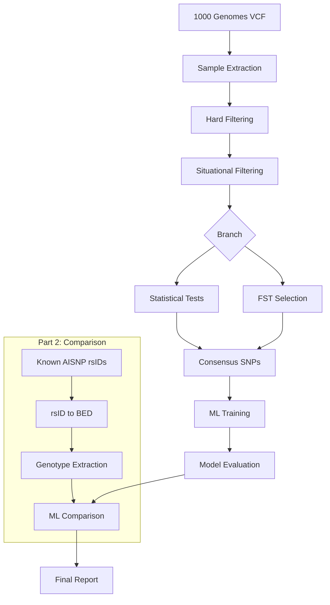
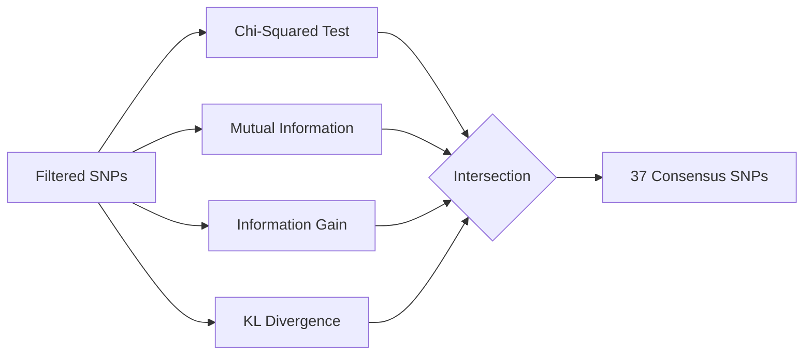
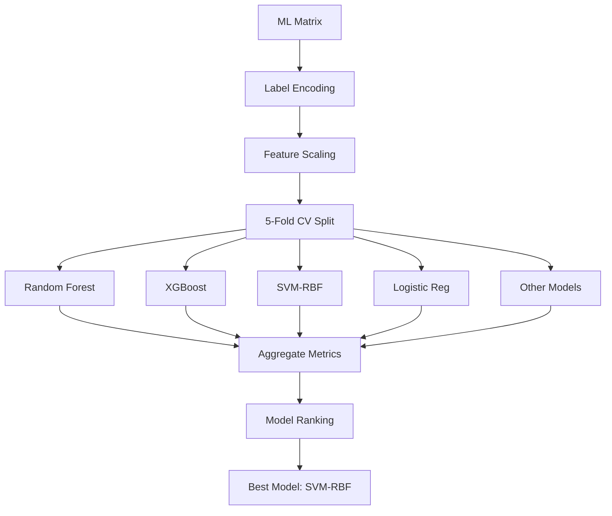

# System Diagrams

This document contains ASCII/Mermaid diagrams describing the AISNP Selection Pipeline architecture, data flow, and system components.

---

## 1. System Block Diagram

### High-Level Architecture

```
┌─────────────────────────────────────────────────────────────────────────────┐
│                        AISNP SELECTION PIPELINE                             │
├─────────────────────────────────────────────────────────────────────────────┤
│                                                                             │
│  ┌─────────────┐    ┌─────────────┐    ┌─────────────┐    ┌─────────────┐  │
│  │   INPUT     │    │  FILTERING  │    │  SELECTION  │    │   OUTPUT    │  │
│  │   LAYER     │───▶│   LAYER     │───▶│   LAYER     │───▶│   LAYER     │  │
│  └─────────────┘    └─────────────┘    └─────────────┘    └─────────────┘  │
│        │                  │                  │                  │          │
│        ▼                  ▼                  ▼                  ▼          │
│  ┌───────────┐      ┌───────────┐      ┌───────────┐      ┌───────────┐   │
│  │ VCF Files │      │ PLINK2    │      │Statistical│      │ ML Models │   │
│  │ Panel CSV │      │ bcftools  │      │  Tests    │      │ Reports   │   │
│  │ Sample IDs│      │ Python    │      │  ML Train │      │ Graphs    │   │
│  └───────────┘      └───────────┘      └───────────┘      └───────────┘   │
│                                                                             │
└─────────────────────────────────────────────────────────────────────────────┘
```

---

## 2. Detailed Pipeline Flow Diagram

```
                              ┌──────────────────┐
                              │  1000 GENOMES    │
                              │  VCF FILE        │
                              │  (84M variants)  │
                              └────────┬─────────┘
                                       │
                                       ▼
                        ┌──────────────────────────┐
                        │  SAMPLE EXTRACTION       │
                        │  • Select EAS samples    │
                        │  • CHB, JPT, KHV only    │
                        │  (n=306)                 │
                        └────────────┬─────────────┘
                                     │
            ┌────────────────────────┴────────────────────────┐
            │                 PART 1: STATISTICAL             │
            │                 SNP SELECTION                   │
            └────────────────────────┬────────────────────────┘
                                     │
                                     ▼
┌───────────────────────────────────────────────────────────────────────────┐
│                         STAGE 1: HARD FILTERING                           │
│  ┌──────────────┐  ┌──────────────┐  ┌──────────────┐  ┌──────────────┐  │
│  │  SNP-only    │  │  Biallelic   │  │  MAF > 0.16% │  │ Call rate    │  │
│  │  filter      │─▶│  filter      │─▶│  filter      │─▶│ > 95%        │  │
│  └──────────────┘  └──────────────┘  └──────────────┘  └──────────────┘  │
└─────────────────────────────────────────┬─────────────────────────────────┘
                                          │
                                          ▼
┌───────────────────────────────────────────────────────────────────────────┐
│                      STAGE 2: SITUATIONAL FILTERING                       │
│  ┌──────────────┐  ┌──────────────┐  ┌──────────────┐                    │
│  │  HWE Test    │  │  Unique ID   │  │  LD Pruning  │                    │
│  │  p < 1e-6    │─▶│  dedup       │─▶│  r² < 0.1    │                    │
│  └──────────────┘  └──────────────┘  └──────────────┘                    │
└─────────────────────────────────────────┬─────────────────────────────────┘
                                          │
                                          ▼
┌───────────────────────────────────────────────────────────────────────────┐
│                     STAGE 3: STATISTICAL SELECTION                        │
│                                                                           │
│    ┌─────────────┐   ┌─────────────┐   ┌─────────────┐   ┌─────────────┐ │
│    │   χ² Test   │   │   Mutual    │   │ Information │   │     KL      │ │
│    │  p < 0.05   │   │ Information │   │    Gain     │   │ Divergence  │ │
│    │   (FDR)     │   │  (Top 500)  │   │  (Top 500)  │   │  (Top 500)  │ │
│    └──────┬──────┘   └──────┬──────┘   └──────┬──────┘   └──────┬──────┘ │
│           │                 │                 │                 │        │
│           └─────────────────┴─────────────────┴─────────────────┘        │
│                                     │                                     │
│                                     ▼                                     │
│                        ┌───────────────────────┐                         │
│                        │     INTERSECTION      │                         │
│                        │   (Consensus SNPs)    │                         │
│                        │      = 37 SNPs        │                         │
│                        └───────────────────────┘                         │
└─────────────────────────────────────────┬─────────────────────────────────┘
                                          │
                                          ▼
┌───────────────────────────────────────────────────────────────────────────┐
│                        STAGE 4: ML TRAINING                               │
│                                                                           │
│    ┌─────────┐  ┌─────────┐  ┌─────────┐  ┌─────────┐  ┌─────────┐      │
│    │   RF    │  │ XGBoost │  │   SVM   │  │   MLP   │  │   ...   │      │
│    └────┬────┘  └────┬────┘  └────┬────┘  └────┬────┘  └────┬────┘      │
│         │            │            │            │            │            │
│         └────────────┴────────────┴────────────┴────────────┘            │
│                                   │                                       │
│                                   ▼                                       │
│                     ┌──────────────────────────┐                         │
│                     │   5-Fold Stratified CV   │                         │
│                     │   Best: SVM (89.55%)     │                         │
│                     └──────────────────────────┘                         │
└─────────────────────────────────────────┬─────────────────────────────────┘
                                          │
                                          │
            ┌─────────────────────────────┴─────────────────────────────┐
            │                                                           │
            ▼                                                           │
┌───────────────────────────────────────────────────────────────────────│───┐
│                      PART 2: PANEL COMPARISON                         │   │
└───────────────────────────────────────────────────────────────────────│───┘
            │                                                           │
            ▼                                                           │
┌───────────────────────────────────────────────────────────────────────────┐
│                        STAGE 5: rsID CONVERSION                           │
│                                                                           │
│  ┌──────────────┐        ┌──────────────┐        ┌──────────────┐        │
│  │  rsID Lists  │  ───▶  │ Ensembl API  │  ───▶  │   BED Files  │        │
│  │  (6 sources) │        │   Query      │        │  (GRCh37)    │        │
│  └──────────────┘        └──────────────┘        └──────────────┘        │
└─────────────────────────────────────────┬─────────────────────────────────┘
                                          │
                                          ▼
┌───────────────────────────────────────────────────────────────────────────┐
│                      STAGE 6: GENOTYPE EXTRACTION                         │
│                                                                           │
│  ┌──────────────┐        ┌──────────────┐        ┌──────────────┐        │
│  │  BED Files   │  ───▶  │   PLINK2     │  ───▶  │  ML Matrix   │        │
│  │              │        │   Extract    │        │   (CSV)      │        │
│  └──────────────┘        └──────────────┘        └──────────────┘        │
└─────────────────────────────────────────┬─────────────────────────────────┘
                                          │
                                          ▼
┌───────────────────────────────────────────────────────────────────────────┐
│                      STAGE 7: ML COMPARISON                               │
│                                                                           │
│  ┌──────────────────────────────────────────────────────────────────┐    │
│  │                                                                   │    │
│  │   cal_et_al    seldin_128    forenseq    kidd_55    hsiao_lin   │    │
│  │   (52 SNPs)    (124 SNPs)    (55 SNPs)   (53 SNPs)  (125 SNPs)  │    │
│  │      │              │            │           │           │       │    │
│  │      └──────────────┴────────────┴───────────┴───────────┘       │    │
│  │                              │                                    │    │
│  │                              ▼                                    │    │
│  │              ┌───────────────────────────────┐                   │    │
│  │              │  Same 7 Classifiers           │                   │    │
│  │              │  Same 5-Fold CV               │                   │    │
│  │              │  Same Metrics                 │                   │    │
│  │              └───────────────────────────────┘                   │    │
│  └──────────────────────────────────────────────────────────────────┘    │
└─────────────────────────────────────────┬─────────────────────────────────┘
                                          │
                                          ▼
                        ┌──────────────────────────┐
                        │      FINAL OUTPUT        │
                        │  • Performance Reports   │
                        │  • Confusion Matrices    │
                        │  • Comparison Graphs     │
                        │  • Ranked Panels         │
                        └──────────────────────────┘
```

---

## 3. Component Diagram

```
┌─────────────────────────────────────────────────────────────────────────────┐
│                            COMPONENT DIAGRAM                                │
├─────────────────────────────────────────────────────────────────────────────┤
│                                                                             │
│  ┌─────────────────────────────────────────────────────────────────────┐   │
│  │                        DATA LAYER                                   │   │
│  │  ┌─────────────┐  ┌─────────────┐  ┌─────────────┐  ┌───────────┐  │   │
│  │  │   VCF       │  │   PLINK     │  │   CSV       │  │   BED     │  │   │
│  │  │   Files     │  │   Files     │  │   Data      │  │   Files   │  │   │
│  │  │ (.vcf.gz)   │  │ (.pgen/pvar │  │ (samples,   │  │ (coords)  │  │   │
│  │  │             │  │  .psam)     │  │  panels)    │  │           │  │   │
│  │  └─────────────┘  └─────────────┘  └─────────────┘  └───────────┘  │   │
│  └─────────────────────────────────────────────────────────────────────┘   │
│                                      │                                      │
│                                      ▼                                      │
│  ┌─────────────────────────────────────────────────────────────────────┐   │
│  │                      PROCESSING LAYER                               │   │
│  │                                                                     │   │
│  │  ┌─────────────────┐   ┌─────────────────┐   ┌─────────────────┐   │   │
│  │  │  hard_filters   │   │  situational_   │   │  fst_selection  │   │   │
│  │  │     .py         │   │  filters.py     │   │     .py         │   │   │
│  │  │                 │   │                 │   │                 │   │   │
│  │  │ • snp_filter()  │   │ • hwe_filter()  │   │ • calc_fst()    │   │   │
│  │  │ • maf_filter()  │   │ • ld_prune()    │   │ • top_snps()    │   │   │
│  │  │ • call_rate()   │   │ • unique_id()   │   │                 │   │   │
│  │  └─────────────────┘   └─────────────────┘   └─────────────────┘   │   │
│  │                                                                     │   │
│  │  ┌─────────────────┐   ┌─────────────────┐   ┌─────────────────┐   │   │
│  │  │  ml_training    │   │  rsid_utils     │   │  bed_to_matrix  │   │   │
│  │  │     .py         │   │     .py         │   │     .py         │   │   │
│  │  │                 │   │                 │   │                 │   │   │
│  │  │ • train_model() │   │ • fetch_coords()│   │ • extract()     │   │   │
│  │  │ • evaluate()    │   │ • cache_rsid()  │   │ • to_matrix()   │   │   │
│  │  │ • cv_score()    │   │                 │   │                 │   │   │
│  │  └─────────────────┘   └─────────────────┘   └─────────────────┘   │   │
│  └─────────────────────────────────────────────────────────────────────┘   │
│                                      │                                      │
│                                      ▼                                      │
│  ┌─────────────────────────────────────────────────────────────────────┐   │
│  │                      UTILITY LAYER                                  │   │
│  │                                                                     │   │
│  │  ┌─────────────────┐   ┌─────────────────┐   ┌─────────────────┐   │   │
│  │  │    config.py    │   │    utils.py     │   │  ml_comparison  │   │   │
│  │  │                 │   │                 │   │     .py         │   │   │
│  │  │ • PATHS         │   │ • load_plink()  │   │                 │   │   │
│  │  │ • PARAMS        │   │ • save_report() │   │ • compare()     │   │   │
│  │  │ • SAMPLES       │   │ • plot_*()      │   │ • rank()        │   │   │
│  │  └─────────────────┘   └─────────────────┘   └─────────────────┘   │   │
│  └─────────────────────────────────────────────────────────────────────┘   │
│                                      │                                      │
│                                      ▼                                      │
│  ┌─────────────────────────────────────────────────────────────────────┐   │
│  │                      EXTERNAL TOOLS                                 │   │
│  │                                                                     │   │
│  │  ┌─────────────┐  ┌─────────────┐  ┌─────────────┐  ┌───────────┐  │   │
│  │  │   PLINK2    │  │  bcftools   │  │  Ensembl    │  │  Python   │  │   │
│  │  │             │  │             │  │  REST API   │  │  ML Libs  │  │   │
│  │  └─────────────┘  └─────────────┘  └─────────────┘  └───────────┘  │   │
│  └─────────────────────────────────────────────────────────────────────┘   │
│                                                                             │
└─────────────────────────────────────────────────────────────────────────────┘
```

---

## 4. Data Flow Diagram

```
                        ┌─────────────────────────────────┐
                        │           DATA STORES           │
                        └─────────────────────────────────┘

┌───────────────────┐       ┌───────────────────┐       ┌───────────────────┐
│   1000genomes/    │       │     output/       │       │     graphs/       │
│   main_vcf/       │       │     ml_models/    │       │     part2/        │
├───────────────────┤       ├───────────────────┤       ├───────────────────┤
│ • ALL_merged.vcf  │       │ • trained models  │       │ • heatmaps.png    │
│ • panel.csv       │       │ • cv_results.csv  │       │ • confusion.png   │
└────────┬──────────┘       └────────▲──────────┘       └────────▲──────────┘
         │                           │                           │
         │                           │                           │
         ▼                           │                           │
┌─────────────────────────────────────────────────────────────────────────────┐
│                                                                             │
│                            PROCESS FLOWS                                    │
│                                                                             │
│   ┌────────────────┐      ┌────────────────┐      ┌────────────────┐       │
│   │   1. EXTRACT   │      │   2. FILTER    │      │   3. SELECT    │       │
│   │                │      │                │      │                │       │
│   │  VCF → EAS     │ ───▶ │  QC → Clean    │ ───▶ │  Stats → Top   │       │
│   │  samples       │      │  variants      │      │  SNPs          │       │
│   └────────────────┘      └────────────────┘      └────────────────┘       │
│           │                       │                       │                 │
│           ▼                       ▼                       ▼                 │
│   ┌────────────────┐      ┌────────────────┐      ┌────────────────┐       │
│   │ EAS_samples.csv│      │ EAS_filtered.  │      │ consensus_snps │       │
│   │ (306 samples)  │      │ pgen/pvar/psam │      │ (37 SNPs)      │       │
│   └────────────────┘      └────────────────┘      └────────────────┘       │
│                                                           │                 │
│                                                           ▼                 │
│   ┌────────────────┐      ┌────────────────┐      ┌────────────────┐       │
│   │   4. TRAIN     │      │   5. EVALUATE  │      │   6. COMPARE   │       │
│   │                │      │                │      │                │       │
│   │  SNPs → ML     │ ◀─── │  CV → Metrics  │ ◀─── │  Sources →     │       │
│   │  matrix        │      │                │      │  Rankings      │       │
│   └────────────────┘      └────────────────┘      └────────────────┘       │
│           │                       │                       │                 │
│           ▼                       ▼                       ▼                 │
│   ┌────────────────┐      ┌────────────────┐      ┌────────────────┐       │
│   │ ml_matrix.csv  │      │ cv_results.csv │      │ comparison.csv │       │
│   │ (306 × 37)     │      │ (models × fold)│      │ (6 sources)    │       │
│   └────────────────┘      └────────────────┘      └────────────────┘       │
│                                                                             │
└─────────────────────────────────────────────────────────────────────────────┘
```

---

## 5. Statistical Selection Diagram

```
┌─────────────────────────────────────────────────────────────────────────────┐
│                    FOUR-TEST CONSENSUS SELECTION                            │
├─────────────────────────────────────────────────────────────────────────────┤
│                                                                             │
│                         INPUT: N SNPs (post-QC)                             │
│                                   │                                         │
│                   ┌───────────────┼───────────────┐                         │
│                   │               │               │                         │
│                   ▼               ▼               ▼                         │
│   ┌───────────────────┐ ┌───────────────────┐ ┌───────────────────┐        │
│   │   CHI-SQUARED     │ │      MUTUAL       │ │    INFORMATION    │        │
│   │      TEST         │ │   INFORMATION     │ │       GAIN        │        │
│   │                   │ │                   │ │                   │        │
│   │  ┌─────────────┐  │ │  ┌─────────────┐  │ │  ┌─────────────┐  │        │
│   │  │ Contingency │  │ │  │ MI(G;P) =   │  │ │  │ IG = H(P) - │  │        │
│   │  │ 3×3 table   │  │ │  │ H(P)-H(P|G) │  │ │  │ ΣP(g)H(P|g) │  │        │
│   │  └─────────────┘  │ │  └─────────────┘  │ │  └─────────────┘  │        │
│   │         │         │ │         │         │ │         │         │        │
│   │         ▼         │ │         ▼         │ │         ▼         │        │
│   │  p-value < 0.05   │ │  Top 500 by MI    │ │  Top 500 by IG    │        │
│   │  (FDR corrected)  │ │                   │ │                   │        │
│   └─────────┬─────────┘ └─────────┬─────────┘ └─────────┬─────────┘        │
│             │                     │                     │                   │
│             │    ┌───────────────────┐                  │                   │
│             │    │ ┌───────────────────┐                │                   │
│             │    │ │     KL DIVERGENCE │                │                   │
│             │    │ │                   │                │                   │
│             │    │ │  ┌─────────────┐  │                │                   │
│             │    │ │  │ KL(P||Q) =  │  │                │                   │
│             │    │ │  │ ΣP(x)log    │  │                │                   │
│             │    │ │  │   (P/Q)     │  │                │                   │
│             │    │ │  └─────────────┘  │                │                   │
│             │    │ │         │         │                │                   │
│             │    │ │         ▼         │                │                   │
│             │    │ │  Top 500 by KL    │                │                   │
│             │    │ └─────────┬─────────┘                │                   │
│             │    └───────────┼───────────────────────────                   │
│             │                │                                              │
│             └────────┬───────┴───────┬──────────────────┘                   │
│                      │               │                                      │
│                      ▼               ▼                                      │
│              ┌─────────────────────────────────────┐                        │
│              │                                     │                        │
│              │   INTERSECTION (∩) of all 4 sets   │                        │
│              │                                     │                        │
│              │   χ² ∩ MI ∩ IG ∩ KL = 37 SNPs     │                        │
│              │                                     │                        │
│              └─────────────────┬───────────────────┘                        │
│                                │                                            │
│                                ▼                                            │
│              ┌─────────────────────────────────────┐                        │
│              │      CONSENSUS SNP RANKING          │                        │
│              │                                     │                        │
│              │   Composite score = avg rank        │                        │
│              │   across all 4 tests                │                        │
│              │                                     │                        │
│              │   OUTPUT: 37 ranked SNPs            │                        │
│              └─────────────────────────────────────┘                        │
│                                                                             │
└─────────────────────────────────────────────────────────────────────────────┘
```

---

## 6. Machine Learning Pipeline Diagram

```
┌─────────────────────────────────────────────────────────────────────────────┐
│                      MACHINE LEARNING PIPELINE                              │
├─────────────────────────────────────────────────────────────────────────────┤
│                                                                             │
│   INPUT                                                                     │
│   ┌────────────────────────────────────────────────────────────────────┐   │
│   │  ML Matrix: 306 samples × (37 SNPs + population label)            │   │
│   └────────────────────────────────────────────────────────────────────┘   │
│                                       │                                     │
│                                       ▼                                     │
│   PREPROCESSING                                                             │
│   ┌────────────────────────────────────────────────────────────────────┐   │
│   │  ┌──────────────┐  ┌──────────────┐  ┌──────────────┐              │   │
│   │  │ Label Encode │  │   Feature    │  │   Stratify   │              │   │
│   │  │ (CHB→0,      │─▶│   Scale      │─▶│   5-Fold     │              │   │
│   │  │  JPT→1,      │  │ (StandardScl)│  │   Split      │              │   │
│   │  │  KHV→2)      │  │              │  │              │              │   │
│   │  └──────────────┘  └──────────────┘  └──────────────┘              │   │
│   └────────────────────────────────────────────────────────────────────┘   │
│                                       │                                     │
│                                       ▼                                     │
│   MODEL TRAINING (5-Fold CV)                                               │
│   ┌────────────────────────────────────────────────────────────────────┐   │
│   │                                                                    │   │
│   │  ┌─────────┐ ┌─────────┐ ┌─────────┐ ┌─────────┐ ┌─────────┐     │   │
│   │  │  Fold 1 │ │  Fold 2 │ │  Fold 3 │ │  Fold 4 │ │  Fold 5 │     │   │
│   │  │Train:244│ │Train:244│ │Train:244│ │Train:244│ │Train:244│     │   │
│   │  │Test: 62 │ │Test: 62 │ │Test: 62 │ │Test: 62 │ │Test: 62 │     │   │
│   │  └────┬────┘ └────┬────┘ └────┬────┘ └────┬────┘ └────┬────┘     │   │
│   │       │           │           │           │           │          │   │
│   │       └───────────┴───────────┴───────────┴───────────┘          │   │
│   │                               │                                   │   │
│   │                               ▼                                   │   │
│   │   ┌────────────────────────────────────────────────────────────┐ │   │
│   │   │                    10 CLASSIFIERS                          │ │   │
│   │   │                                                            │ │   │
│   │   │  ┌───────┐ ┌───────┐ ┌───────┐ ┌───────┐ ┌───────┐       │ │   │
│   │   │  │  RF   │ │XGBoost│ │ LogReg│ │SVM-RBF│ │SVM-Lin│       │ │   │
│   │   │  └───────┘ └───────┘ └───────┘ └───────┘ └───────┘       │ │   │
│   │   │  ┌───────┐ ┌───────┐ ┌───────┐ ┌───────┐ ┌───────┐       │ │   │
│   │   │  │  KNN  │ │  NB   │ │  GB   │ │  MLP  │ │AdaBoost│      │ │   │
│   │   │  └───────┘ └───────┘ └───────┘ └───────┘ └───────┘       │ │   │
│   │   └────────────────────────────────────────────────────────────┘ │   │
│   └────────────────────────────────────────────────────────────────────┘   │
│                                       │                                     │
│                                       ▼                                     │
│   EVALUATION                                                               │
│   ┌────────────────────────────────────────────────────────────────────┐   │
│   │  ┌──────────────┐  ┌──────────────┐  ┌──────────────┐              │   │
│   │  │   Accuracy   │  │   F1-Score   │  │   Confusion  │              │   │
│   │  │   (mean±std) │  │   (mean±std) │  │   Matrix     │              │   │
│   │  └──────────────┘  └──────────────┘  └──────────────┘              │   │
│   │  ┌──────────────┐  ┌──────────────┐  ┌──────────────┐              │   │
│   │  │   Precision  │  │    Recall    │  │  Overfit Gap │              │   │
│   │  │              │  │              │  │  (Train-Test)│              │   │
│   │  └──────────────┘  └──────────────┘  └──────────────┘              │   │
│   └────────────────────────────────────────────────────────────────────┘   │
│                                       │                                     │
│                                       ▼                                     │
│   OUTPUT                                                                    │
│   ┌────────────────────────────────────────────────────────────────────┐   │
│   │  • cv_results.csv        (performance metrics)                     │   │
│   │  • feature_importance.csv (RF + LogReg combined)                   │   │
│   │  • confusion_matrix.png   (visualization)                          │   │
│   │  • model_comparison.png   (bar charts)                             │   │
│   └────────────────────────────────────────────────────────────────────┘   │
│                                                                             │
└─────────────────────────────────────────────────────────────────────────────┘
```

---

## 7. Part 2 Panel Comparison Flow

```
┌─────────────────────────────────────────────────────────────────────────────┐
│                     PANEL COMPARISON PIPELINE                               │
├─────────────────────────────────────────────────────────────────────────────┤
│                                                                             │
│   KNOWN AISNP SOURCES                                                       │
│   ┌────────────────────────────────────────────────────────────────────┐   │
│   │                                                                    │   │
│   │  ┌────────────┐  ┌────────────┐  ┌────────────┐  ┌────────────┐  │   │
│   │  │ cal_et_al  │  │ seldin_128 │  │  forenseq  │  │  kidd_55   │  │   │
│   │  │  (52 SNPs) │  │ (124 SNPs) │  │  (55 SNPs) │  │  (53 SNPs) │  │   │
│   │  └─────┬──────┘  └─────┬──────┘  └─────┬──────┘  └─────┬──────┘  │   │
│   │        │               │               │               │         │   │
│   │  ┌─────┴───────────────┴───────────────┴───────────────┴─────┐   │   │
│   │  │                                                           │   │   │
│   │  │  ┌────────────┐              ┌────────────┐              │   │   │
│   │  │  │hsiao_lin   │              │statistical │              │   │   │
│   │  │  │ (125 SNPs) │              │  (37 SNPs) │              │   │   │
│   │  │  └─────┬──────┘              └─────┬──────┘              │   │   │
│   │  │        │                           │                     │   │   │
│   │  └────────┴───────────────────────────┴─────────────────────┘   │   │
│   │                               │                                  │   │
│   └───────────────────────────────┼──────────────────────────────────┘   │
│                                   │                                       │
│                                   ▼                                       │
│   CONVERSION PIPELINE                                                      │
│   ┌────────────────────────────────────────────────────────────────────┐   │
│   │  ┌──────────────┐   ┌──────────────┐   ┌──────────────┐            │   │
│   │  │   rsID List  │   │   Ensembl    │   │    BED       │            │   │
│   │  │   (CSV/TXT)  │──▶│   REST API   │──▶│   File       │            │   │
│   │  │              │   │   Query      │   │  (GRCh37)    │            │   │
│   │  └──────────────┘   └──────────────┘   └──────────────┘            │   │
│   └───────────────────────────────────────────────────────┬────────────┘   │
│                                                           │                 │
│                                                           ▼                 │
│   GENOTYPE EXTRACTION                                                       │
│   ┌────────────────────────────────────────────────────────────────────┐   │
│   │  ┌──────────────┐   ┌──────────────┐   ┌──────────────┐            │   │
│   │  │   BED File   │   │   PLINK2     │   │   ML Matrix  │            │   │
│   │  │  (coords)    │──▶│   Extract    │──▶│   (CSV)      │            │   │
│   │  │              │   │   --keep     │   │ 306 × N_SNPs │            │   │
│   │  └──────────────┘   └──────────────┘   └──────────────┘            │   │
│   └───────────────────────────────────────────────────────┬────────────┘   │
│                                                           │                 │
│                                                           ▼                 │
│   UNIFIED COMPARISON                                                        │
│   ┌────────────────────────────────────────────────────────────────────┐   │
│   │                                                                    │   │
│   │  ┌────────────────────────────────────────────────────────────┐   │   │
│   │  │              FOR EACH SOURCE (6 total):                    │   │   │
│   │  │                                                            │   │   │
│   │  │    ┌──────────┐    ┌──────────┐    ┌──────────┐           │   │   │
│   │  │    │ Load ML  │───▶│ Run 7    │───▶│ Collect  │           │   │   │
│   │  │    │ Matrix   │    │ Classif. │    │ Metrics  │           │   │   │
│   │  │    │          │    │ × 5 Fold │    │          │           │   │   │
│   │  │    └──────────┘    └──────────┘    └──────────┘           │   │   │
│   │  │                                                            │   │   │
│   │  └────────────────────────────────────────────────────────────┘   │   │
│   │                               │                                    │   │
│   │                               ▼                                    │   │
│   │  ┌────────────────────────────────────────────────────────────┐   │   │
│   │  │              AGGREGATE & COMPARE                           │   │   │
│   │  │                                                            │   │   │
│   │  │  • Pivot tables (Accuracy × Source × Model)                │   │   │
│   │  │  • Best model per source                                   │   │   │
│   │  │  • SNPs vs Accuracy analysis                               │   │   │
│   │  │  • Overfit gap comparison                                  │   │   │
│   │  │  • Confusion matrices                                      │   │   │
│   │  │                                                            │   │   │
│   │  └────────────────────────────────────────────────────────────┘   │   │
│   │                               │                                    │   │
│   └───────────────────────────────┼────────────────────────────────────┘   │
│                                   │                                        │
│                                   ▼                                        │
│   OUTPUT FILES                                                             │
│   ┌────────────────────────────────────────────────────────────────────┐   │
│   │  • ml_comparison_results.csv   (all results)                       │   │
│   │  • accuracy_by_source.csv      (pivot table)                       │   │
│   │  • performance_heatmaps.png    (visualization)                     │   │
│   │  • confusion_matrices.png      (per source)                        │   │
│   │  • snps_vs_accuracy.png        (scatter)                           │   │
│   │  • ml_comparison_report.txt    (summary)                           │   │
│   └────────────────────────────────────────────────────────────────────┘   │
│                                                                             │
└─────────────────────────────────────────────────────────────────────────────┘
```

---

## 8. File System Structure Diagram

```
BioinfoMidterm/
│
├── 1000genomes/                          # Input & intermediate data
│   ├── main_vcf/
│   │   ├── ALL_merged.vcf.gz            # Source VCF
│   │   ├── ALL_merged.vcf.gz.tbi        # Index
│   │   └── *.panel                       # Sample metadata
│   │
│   ├── output/
│   │   ├── EAS_AND_SNP_filtered_data.*  # Hard filtered
│   │   ├── EAS_FINAL_DATA_FOR_FST.*     # Final QC'd data
│   │   ├── EAS_FST_RESULTS.*            # FST results
│   │   ├── consensus_snps_*.csv         # ML results
│   │   └── statistical_*.csv             # Statistical results
│   │
│   └── *.csv                             # Sample lists
│
├── data/
│   └── known_aisnps/                     # Part 2 rsID sources
│       ├── cal_et_al.csv
│       ├── seldin_128.csv
│       ├── forenseq.csv
│       ├── kidd_55.csv
│       └── hsiao_lin_hwa.csv
│
├── scripts/
│   ├── config.py                         # Centralized config
│   ├── utils.py                          # Utilities
│   ├── hard_filters.py                   # Stage 1
│   ├── situational_filters.py            # Stage 2
│   ├── fst_selection.py                  # FST analysis
│   ├── ml_training.py                    # ML utilities
│   │
│   ├── notebooks/
│   │   ├── 01_hard_filtering.ipynb
│   │   ├── 02_situational_filtering.ipynb
│   │   ├── 02b_statistical_snp_selection.ipynb
│   │   ├── 03_fst_and_pca.ipynb
│   │   ├── 04c_ml_consensus_snps.ipynb
│   │   └── part2/
│   │       ├── 06_rsid_to_bed.ipynb
│   │       ├── 07_bed_to_ml_matrix.ipynb
│   │       └── 08_known_aisnps_ml.ipynb
│   │
│   └── part2/
│       ├── rsid_utils.py
│       ├── bed_to_matrix.py
│       └── ml_comparison.py
│
├── output/
│   ├── ml_models/                        # Trained models
│   └── part2/
│       ├── *_ml_matrix.csv               # Extracted genotypes
│       ├── ml_comparison_results.csv
│       └── *.csv                          # Results
│
├── graphs/
│   └── part2/
│       ├── snp_counts_by_source.png
│       ├── performance_heatmaps.png
│       ├── best_models_comparison.png
│       ├── confusion_matrices.png
│       └── snps_vs_accuracy.png
│
├── docs/
│   ├── CONFIGURATION.md
│   ├── PIPELINE.md
│   ├── RESULTS.md
│   ├── RESULTS_PART2.md
│   ├── slides/
│   │   └── PRESENTATION_OUTLINE.md
│   └── diagrams/
│       └── SYSTEM_DIAGRAMS.md
│
└── README.md
```

---

## 9. Mermaid Diagrams (For rendering in compatible viewers)

### Pipeline Flow (Mermaid)



### Statistical Selection (Mermaid)



### ML Pipeline (Mermaid)



---

## Usage Notes

1. **ASCII Diagrams**: Work in any text editor or Markdown viewer
2. **Mermaid Diagrams**: Render in GitHub, VS Code (with extension), or Mermaid live editor
3. **Color Coding**: Add colors when converting to presentation slides
4. **Scale**: Diagrams can be simplified for slides or expanded for documentation

---

*Diagrams created for AISNP Selection Pipeline*  
*Version 1.0 - January 2026*
