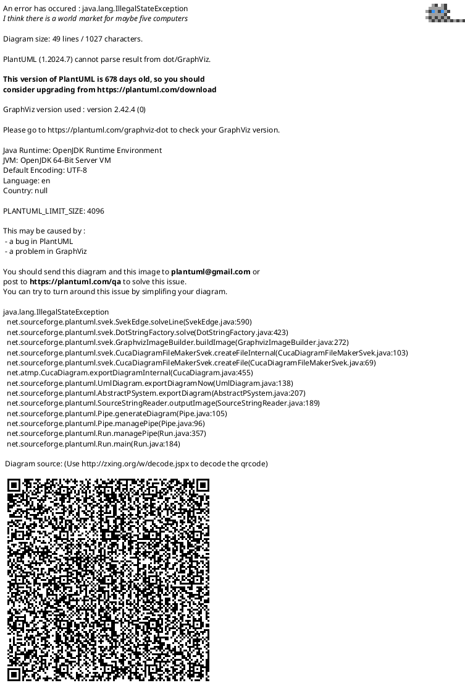

```mermaid
flowchart LR
    subgraph Actors
        R[👤 Researcher]
        DS[👤 Data Scientist]
        B[👤 Bioinformatician]
    end
    
    subgraph "AISNP Selection System"
        UC1((Load VCF Data))
        UC2((Apply Quality Filters))
        UC3((Run Statistical Tests))
        UC4((Train ML Models))
        UC5((Evaluate Models))
        UC6((Compare AISNP Panels))
        UC7((Generate Reports))
        UC8((Export Results))
    end
    
    R --> UC1
    R --> UC7
    DS --> UC4
    DS --> UC5
    DS --> UC6
    B --> UC2
    B --> UC3
    B --> UC8
    
    UC1 -.->|include| UC2
    UC2 -.->|include| UC3
    UC3 -.->|include| UC4
    UC4 -.->|include| UC5
    UC6 -.->|extend| UC5
```

```mermaid
graph TB
    subgraph "Data Layer"
        VCF[📁 VCF Files]
        PLINK[📁 PLINK Files]
        CSV[📁 CSV Data]
        BED[📁 BED Files]
        DB[(1000 Genomes)]
    end
    
    subgraph "Processing Layer"
        HF[HardFilters]
        SF[SituationalFilters]
        ST[StatisticalTests]
        FST[FSTSelection]
    end
    
    subgraph "ML Layer"
        MLT[MLTraining]
        ME[ModelEvaluation]
        PC[PanelComparison]
    end
    
    subgraph "Utility Layer"
        CFG[Config]
        UTL[Utils]
        PLT[Plotting]
    end
    
    subgraph "External Tools"
        P2[PLINK2]
        BCF[bcftools]
        ENS[Ensembl API]
        SKL[scikit-learn]
    end
    
    DB --> VCF
    VCF --> HF
    HF --> PLINK
    PLINK --> SF
    SF --> ST
    ST --> MLT
    MLT --> ME
    PC --> ME
    
    HF -.-> P2
    SF -.-> P2
    BED -.-> ENS
    MLT -.-> SKL
    
    CFG --> HF
    CFG --> SF
    CFG --> MLT
```

```plantuml
@startuml Activity Diagram - Statistical Selection
|Filtering|
start
:Receive QC-passed SNPs;
note right: N SNPs after QC

|Chi-Squared|
:Create 3x3 Contingency Table;
:Calculate χ² statistic;
:Apply FDR Correction;
if (q-value < 0.05?) then (yes)
    :Add to χ² set;
else (no)
    :Exclude;
endif

|Mutual Information|
:Calculate H(Population);
:Calculate H(Population|Genotype);
:Compute MI = H(P) - H(P|G);
:Rank all SNPs by MI;
:Select Top 500;

|Information Gain|
:Calculate Population Entropy;
:Calculate Conditional Entropy;
:Compute IG = H - Σ P(g)·H(P|g);
:Rank all SNPs by IG;
:Select Top 500;

|KL Divergence|
:Get Genotype Distribution per Pop;
:Calculate Pairwise KL(P||Q);
:Average Across Population Pairs;
:Rank all SNPs by Avg KL;
:Select Top 500;

|Consensus|
:Compute Set Intersection;
note right
    Consensus = χ² ∩ MI ∩ IG ∩ KL
end note

:Calculate Composite Rank;
note right: Average rank across tests

:Output 37 Consensus SNPs;
stop

@enduml
```

# System Diagrams (UML)

This document contains UML diagrams describing the AISNP Selection Pipeline architecture, data flow, and system components using PlantUML and Mermaid syntax.

---

## Table of Contents

1. [Use Case Diagram](#1-use-case-diagram)
2. [Component Diagram](#2-component-diagram)
3. [Activity Diagram - Main Pipeline](#3-activity-diagram---main-pipeline)
4. [Activity Diagram - Statistical Selection](#4-activity-diagram---statistical-selection)
5. [Sequence Diagram - ML Training](#5-sequence-diagram---ml-training)
6. [Class Diagram](#6-class-diagram)
7. [Deployment Diagram](#7-deployment-diagram)
8. [State Machine Diagram](#8-state-machine-diagram)
9. [Package Diagram](#9-package-diagram)
10. [Data Flow Diagram (DFD)](#10-data-flow-diagram-dfd)

---

## 1. Use Case Diagram

### PlantUML


### Mermaid



---

## 2. Component Diagram

### PlantUML


### Mermaid



---

## 3. Activity Diagram - Main Pipeline

### PlantUML


### Mermaid


---

## 4. Activity Diagram - Statistical Selection

### PlantUML



### Mermaid


---

## 5. Sequence Diagram - ML Training

### PlantUML


### Mermaid


---

## 6. Class Diagram

### PlantUML


### Mermaid


---

## 7. Deployment Diagram

### PlantUML



### Mermaid


---

## 8. State Machine Diagram

### PlantUML


### Mermaid


---

## 9. Package Diagram

### PlantUML


### Mermaid


---

## 10. Data Flow Diagram (DFD)

### PlantUML - Level 0 (Context)


### PlantUML - Level 1 (Main Processes)


### Mermaid - DFD Level 1

```mermaid
flowchart LR
    VCF[(1000 Genomes VCF)]
    KP[(Known AISNP Panels)]
    
    P1[/"1.0 Quality Filtering"/]
    P2[/"2.0 Statistical Selection"/]
    P3[/"3.0 ML Training"/]
    P4[/"4.0 Panel Comparison"/]
    P5[/"5.0 Report Generation"/]
    
    D1[(Filtered PLINK Files)]
    D2[(Consensus SNPs)]
    D3[(ML Results)]
    D4[(Comparison Results)]
    Reports[(Final Reports)]
    
    VCF --> P1
    P1 --> D1
    D1 --> P2
    P2 --> D2
    D2 --> P3
    P3 --> D3
    
    KP --> P4
    D1 --> P4
    P4 --> D4
    
    D3 --> P5
    D4 --> P5
    P5 --> Reports
```

---

## Diagram Rendering Tools

### PlantUML Rendering
- **Online**: [PlantUML Web Server](http://www.plantuml.com/plantuml)
- **VS Code**: PlantUML extension
- **IntelliJ**: PlantUML integration plugin
- **Command Line**: `java -jar plantuml.jar diagram.puml`

### Mermaid Rendering
- **GitHub**: Native support in Markdown
- **VS Code**: Markdown Preview Mermaid Support extension
- **Online**: [Mermaid Live Editor](https://mermaid.live)
- **Documentation**: [Mermaid Docs](https://mermaid.js.org/)

---

## Export Formats

| Format | PlantUML | Mermaid |
|--------|----------|---------|
| PNG | ✅ | ✅ |
| SVG | ✅ | ✅ |
| PDF | ✅ | ✅ |
| ASCII | ✅ | ❌ |
| LaTeX | ✅ | ❌ |

---

*UML Diagrams for AISNP Selection Pipeline*  
*Version 2.0 - January 2026*
