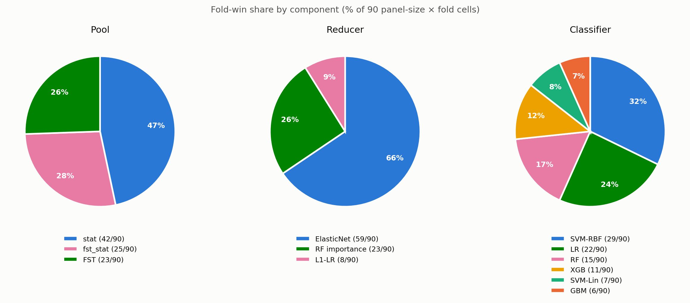
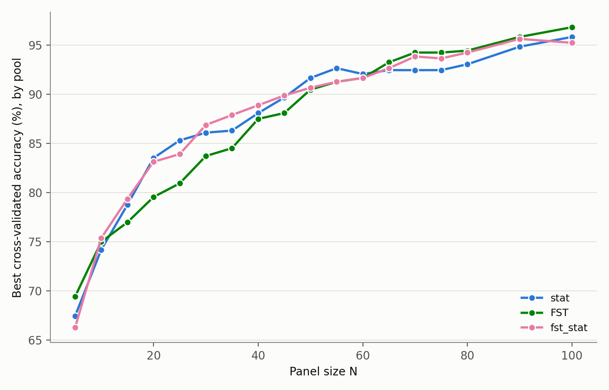
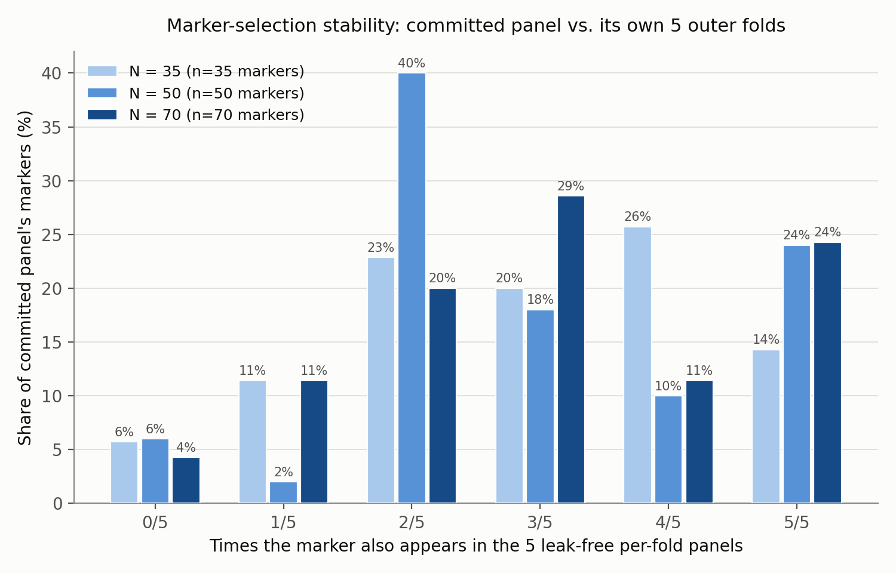

# Selection of Ancestry-Informative SNP Panels for Within-East-Asian Population Discrimination

**Authors:** *Nguyễn Đức Hùng — 20233960*

---

**Abstract**—Ancestry-informative SNPs (AISNPs) allow genetic ancestry to be inferred from a small, targeted marker panel rather than genome-wide data, with applications in forensic identification, pharmacogenomics, and population genetics. This work targets a deliberately hard instance of the problem: discriminating three East Asian subpopulations — Han Chinese, Japanese (JPT), and Southeast Asian (SEA: Kinh Vietnamese and Dai Chinese) — using 504 individuals from the 1000 Genomes Project Phase 3, all of whom belong to the same continental super-population. A pipeline was built to construct candidate SNP pools (via population-differentiation statistics, pairwise Hudson $F_{\text{ST}}$, or their consensus), rank candidates with a supervised feature reducer (ElasticNet, L1-penalized logistic regression, or random-forest importance), and evaluate panels of size N = 5–100 across six classifiers. Because every step in this selection chain uses sample labels, the entire chain — candidate-pool construction, feature ranking, and classification — is rebuilt inside each cross-validation fold (§IV-C). Two complementary estimates are reported throughout: **Blind Selection**, in which an inner cross-validation loop chooses the (pool, reductor, classifier) configuration per fold without ever seeing that fold's test data, carrying no selection optimism of any kind, used first to validate that the search approach itself generalizes honestly; and **Best Fixed Configuration**, in which the single configuration scoring highest across a 4,860-fit grid (18 panel sizes × 3 pools × 3 reductors × 6 classifiers × 5 folds) is named as the recommended, deployable panel design once that validation holds, reported alongside Blind Selection as a bias-free anchor, since scanning many configurations and reporting the maximum carries its own mild, disclosed optimism. Under this protocol, ElasticNet is the unambiguous best feature reducer at every evaluated panel size (18 of 18), and a 70-SNP panel reaches 92.9% (Blind Selection) to 94.25% (Best Fixed Configuration) accuracy — the latter matching an external, expert-curated 34-SNP panel (Cai et al., 2024; 94.6%). Candidate-pool choice, by contrast, turns out to be the least trustworthy part of a naive hindsight reading: the grid's own per-panel-size winner spreads across all three candidate pools with no clean pattern, while an honest, blind selection process converges overwhelmingly on one of them (a consensus pool cascading the statistical criteria onto $F_{\text{ST}}$'s own candidates) in 60% of its independent picks — the two views agree on which pool is best at only 4 of 18 panel sizes. This divergence is disclosed and used to inform, rather than override, the final recommendation. The result is a reproducible, automated panel-selection pipeline that reaches parity with expert-curated panels, with every source of in-sample optimism in its own accuracy estimate — including which candidate pool looks best only in hindsight — identified, measured, and disclosed rather than assumed away.

**Index Terms**—Ancestry-informative SNPs, cross-validation, feature selection, forensic genetics, machine learning, nested cross-validation, population genetics, selection bias.

---

## I. Introduction

A single nucleotide polymorphism (SNP) is a position in the genome at which individuals commonly carry one of two alternative bases. SNPs are the most abundant form of human genetic variation, and the large majority carry no information about an individual's ancestry because their allele frequencies are similar across populations. A small subset, however, show allele frequencies that differ substantially between population groups; these are termed ancestry-informative SNPs (AISNPs) [@kidd2014]. A panel of a few dozen to a few hundred well-chosen AISNPs can predict an individual's population of origin with accuracy approaching that obtained from genome-wide data, at a fraction of the genotyping cost, which motivates selecting minimal, maximally discriminative AISNP panels rather than genotyping exhaustively. §II formalizes these concepts, and the statistical and machine-learning methods built on top of them, before the data and pipeline are described.

Panels intended to separate continental-level ancestry groups — European, African, East Asian, and so on — are comparatively easy to construct, because allele frequency differences between continents are large and concentrated at many loci. This work targets a harder problem: discriminating between three populations that all belong to the same continental super-population, East Asian (EAS). As defined here, the three groups are Han Chinese (a merge of the CHB and CHS 1000 Genomes sub-populations), Japanese (JPT), and a Southeast Asian group (SEA, a merge of KHV and CDX). Because these groups share recent common ancestry and historical gene flow, allele frequency differences between them are small and diffuse across many loci rather than concentrated in a handful of highly differentiated markers. Within-EAS discrimination therefore requires both a more careful candidate-marker search than continental-level panels need, and — as this report's methodology reflects — a more careful evaluation protocol, since a search over hundreds of thousands of candidate SNPs is itself capable of manufacturing apparent discriminative power that will not replicate out of sample (§IV, §V).

Fine-grained ancestry inference within a single continental group has several practical motivations:

- **Forensic identification and missing-persons casework.** Investigators may need to narrow a candidate pool using ancestry finer than the coarse continental categories most existing forensic AISNP panels are built for — for example, distinguishing a Han Chinese from a Japanese individual, which continental-level panels cannot do.
- **Pharmacogenomics.** Drug metabolism, dosing, and adverse-event risk can vary by fine-grained ancestry even within groups that are indistinguishable at the continental level, making within-continent panels relevant to precision-medicine applications.
- **Population genetics research.** Compact, validated marker sets make it cheaper to characterize fine-scale population structure and migration history within East Asia at scale, without full genome sequencing.

Three published panels address related within- or near-East-Asian population-discrimination tasks and serve as external benchmarks throughout this report (§V): Cai et al. [@cai2024], Cao et al. [@cao2022], a 19-SNP panel, and Shi et al. [@shi2019], a family of nested panels (36, 59, 98, and 142 SNPs). All three were selected on cohorts external to the one used in this report, so — unlike the panels developed here — their reported performance carries no in-sample selection optimism; this asymmetry is discussed further in §IV and is central to how comparisons in §V should be read.

The most directly comparable of the three is Cai et al. [@cai2024], which is used throughout this report as the primary external reference point (§V). Working from 1000 Genomes Project Phase 3 genotypes spanning 26 populations, the authors trained Random Forest classifiers with a one-vs-rest, embedded feature-selection strategy to screen candidate ancestry-informative SNPs genome-wide, and built six nested panels of increasing marker density (50 to 2,000 SNPs) for general biogeographic ancestry inference; differentiation efficiency (measured by PCA) at the 2,000-SNP density was comparable to using all available loci. From this screening the authors also report a compact, deployable table of 58 SNPs, annotated by locus type: 24 markers most informative for continental-level assignment and 34 markers specifically informative for discrimination *within* East Asia. The latter 34-SNP subset is the panel referred to throughout this report as "Cai-34," extracted from the paper's supplementary marker table together with each SNP's reported allele frequencies and chromosomal coordinates. In their own evaluation, an XGBoost classifier is reported to reach 0.94 accuracy for five-population continental assignment and 0.92 for intra-East-Asian assignment; the paper's abstract does not specify which nested panel size each figure corresponds to, so these should not be assumed to be the Cai-34 subset's own reported accuracy specifically. The 94.6% figure attributed to "Cai-34" in §V of this report is instead an independent measurement: the 34 SNPs are re-genotyped in the present 1000 Genomes EAS cohort and re-evaluated end-to-end under this report's own six-classifier, five-fold cross-validation protocol (§IV). The two numbers are therefore not a replication of one another but two separate measurements of the same marker set, and their agreement is informative rather than assumed.

This report makes two contributions. First, it describes an automated pipeline that selects compact AISNP panels for the Han/JPT/SEA discrimination task from 1000 Genomes Project Phase 3 data [@tgp2015], in which the entire supervised selection chain — candidate-pool construction, feature ranking, and classification — is rebuilt inside each cross-validation fold (§IV-C). Second, it discloses and quantifies a second, smaller form of selection optimism that remains even under that design: naming a single recommended configuration from a large configuration grid carries its own mild, measurable bias, which this report addresses by reporting every recommended configuration's accuracy alongside a fully blind, nested estimate. The remainder of this report is organized as follows. Section II provides theoretical background on SNPs, ancestry-informative markers, and the statistical and machine-learning methods used throughout. Section III describes the data and cohort. Section IV describes the panel-selection pipeline: what is searched over, how the search is validated, and how confident each part of the eventual recommendation should be treated. Section V applies that validated pipeline to this cohort and compares it against the published panels above. Section VI discusses what the comparison between the two estimates means and what follows from it.

## II. Theoretical Background

This section introduces, in one place, the population-genetics and machine-learning concepts used throughout the rest of this report: what a SNP and an AISNP are (§II-A), the statistics used to nominate candidate markers (§II-B, §II-C), and the models used to reduce and classify panels (§II-D, §II-E). Readers already familiar with these concepts may proceed directly to §III.

### A. SNPs and Ancestry-Informative SNPs

A single nucleotide polymorphism (SNP) is a position in the genome at which the DNA base observed varies across individuals in a population. The overwhelming majority of common human SNPs are biallelic: at a given position, only two of the four possible bases — conventionally termed the reference and alternate alleles — are observed with appreciable frequency. An individual's genotype at a SNP is the pair of alleles inherited from each parent (homozygous reference, heterozygous, or homozygous alternate), and the allele frequency at a SNP within a given population is the proportion of all alleles observed at that position, across all individuals in that population, that are the alternate allele.

Most SNPs carry no information about ancestry, because their allele frequency is similar across population groups. A SNP is termed ancestry-informative when its allele frequency instead differs substantially between population groups [@kidd2014]: observing an individual's genotype at such a SNP shifts the probability that the individual belongs to one population group rather than another. No single AISNP is a reliable ancestry predictor on its own — allele-frequency differences are rarely large enough, and any one genotype observation is noisy — but combining the genotypes of many AISNPs, typically through a statistical or machine-learning classifier, can predict population membership with accuracy approaching that of genome-wide data at a small fraction of the genotyping cost. This is the practical motivation, introduced in §I, for constructing compact AISNP panels rather than genotyping exhaustively.

### B. Population-Differentiation Statistics

Three complementary statistics are used in this report (§IV-A) to screen individual SNPs for ancestry informativeness, each formalizing "differs substantially between population groups" in a different way.

- **Chi-squared test (χ²).** For a given SNP, a contingency table is formed with population group as one dimension and genotype (homozygous-reference / heterozygous / homozygous-alternate) as the other; the χ² statistic tests the null hypothesis that genotype is statistically independent of population group. A large χ² statistic indicates that genotype frequency at that SNP depends strongly on population membership, which is precisely the property an ancestry-informative SNP should have.
- **Jensen-Shannon divergence (JSD) [@lin1991].** At a given SNP, each population's genotype-frequency profile — the proportion of that population's individuals falling into each of the three genotype categories — is treated as a probability distribution $P_i$ over those three categories. With $k$ populations (here $k=3$: Han, JPT, SEA), JSD is the average Kullback-Leibler (KL) divergence of each population's distribution from their mean, or "mixture," distribution:

$$\mathrm{JSD}(P_1,\dots,P_k) \;=\; \frac{1}{k}\sum_{i=1}^{k}\mathrm{KL}\!\left(P_i \,\middle\|\, M\right), \qquad M = \frac{1}{k}\sum_{i=1}^{k}P_i, \qquad \mathrm{KL}(P\,\|\,M) = \sum_{v}P(v)\log\frac{P(v)}{M(v)}$$

  where $v$ ranges over the three genotype categories. Unlike KL divergence itself, JSD is symmetric in the $P_i$, non-negative, and bounded above. A JSD near zero means the populations' genotype distributions at that SNP are nearly indistinguishable; a large JSD means at least one population's genotype distribution diverges sharply from the group average.
- **Allele-frequency difference (AFD).** Writing $p_i$ for population $i$'s allele frequency at a SNP — the proportion of alleles across that population's individuals that are the alternate allele — AFD is the largest absolute allele-frequency gap across all population pairs:

$$\mathrm{AFD} = \max_{i,j}\,\lvert p_i - p_j\rvert$$

  taken over the three pairs (Han, JPT), (Han, SEA), (JPT, SEA). AFD does not account for sample size or estimation variance the way χ² does, but it is directly interpretable and computationally inexpensive.

Because these three statistics formalize ancestry informativeness in related but non-identical ways, they were retained as complementary criteria — after a preliminary evaluation confirmed several other candidate statistics were redundant with one of these three (§IV-A) — rather than collapsed into a single ranking.

### C. $F_{\text{ST}}$ (Wright's Fixation Index)

Wright's fixation index ($F_{\text{ST}}$) [@wright1951] is a classical population-genetics statistic that quantifies genetic differentiation between two or more subpopulations as the proportion of total allele-frequency variance attributable to differences *between* subpopulations, as opposed to variance *within* a subpopulation. $F_{\text{ST}}$ ranges from 0, when subpopulations have identical allele frequencies, to 1, when subpopulations are completely differentiated (fixed for different alleles). Unlike the statistics in §II-B, which are computed per SNP independently of any particular pair of groups, $F_{\text{ST}}$ is naturally a pairwise quantity: this report computes Hudson's $F_{\text{ST}}$ estimator [@bhatia2013] for each of the three population pairs (Han–JPT, Han–SEA, JPT–SEA) separately, using plink2 [@chang2015]. For two populations with allele frequencies $p_1, p_2$ and sample sizes $n_1, n_2$ at a given SNP, Hudson's per-locus estimator is

$$F_{ST} \;=\; \frac{(p_1-p_2)^2 \;-\; \dfrac{p_1(1-p_1)}{n_1-1} \;-\; \dfrac{p_2(1-p_2)}{n_2-1}}{p_1(1-p_2) + p_2(1-p_1)}$$

The numerator estimates the between-population component of allele-frequency variance, with the two subtracted terms correcting for finite-sample variance within each population; the denominator normalizes by heterozygosity. This correction is what gives Hudson's estimator better behavior than Wright's original formulation under small or unequal sample sizes, and is the estimator implemented in plink2, which motivates its use here.

$F_{\text{ST}}$ and AFD (§II-B) are related but not redundant: $F_{\text{ST}}$ normalizes by within-population heterozygosity and consequently upweights rare, drift-fixed variants, whereas AFD treats all allele frequencies equally, so the two approaches capture partly orthogonal signal — one of the reasons both are retained as separate candidate-pool criteria (§IV-A).

### D. Feature Reduction Methods

A reductor ranks SNPs within a candidate pool so that the top-N can be selected as a compact panel. Three were used in this study:

- **L1-penalized logistic regression (L1-LR).** Logistic regression fits a linear model that estimates class probabilities via a logistic (sigmoid) transformation of a weighted sum of input features; the L1 penalty added on top of the standard fit drives most feature coefficients to exactly zero, so that only the SNPs the model finds most useful retain a non-zero weight, producing a maximally sparse ranking.
- **ElasticNet (EN) [@zou2005].** A penalized linear model combining an L1 penalty, which induces sparsity as in L1-LR, with an L2 penalty, which stabilizes coefficient estimates when features are correlated with one another. This combination tends to help when candidate SNPs are correlated, as many remain even after linkage-disequilibrium pruning (§III-B), since that pruning removes only near-redundant pairs, not all correlation structure. SNPs are ranked by the magnitude of their fitted ElasticNet coefficient.
- **Random Forest importance (RF) [@breiman2001].** Random Forest importance ranks features by the mean decrease in Gini impurity they produce across all trees in a fitted forest (§II-E). Unlike the two linear reductors above, this can capture non-linear interactions between SNPs, at the cost of being less directly interpretable than a single linear coefficient.

All three reductors, together with the Random Forest, Logistic Regression, and both Support Vector Machine variants used as classifiers below, are implemented via the scikit-learn library [@pedregosa2011].

### E. Classification Models

Six classifiers were evaluated at the panel-scoring stage of this study:

- **Random Forest (RF) [@breiman2001].** An ensemble of decision trees, each trained on a bootstrap-resampled subset of the data and a random subset of features; predictions are combined by majority vote across trees. Also used, via its feature-importance scores, as a reductor (§II-D).
- **XGBoost (XGB) [@chen2016].** A gradient-boosted ensemble of decision trees, in which each new tree is trained specifically to correct the residual errors of the trees already in the ensemble. Generally a strong performer on tabular data of this kind.
- **Logistic Regression (LR).** The unpenalized (L2-regularized) form of the linear model described in §II-D, used here purely as a classifier.
- **Support Vector Machine (SVM) [@cortes1995].** A classifier that seeks the decision boundary maximizing the margin between classes. The linear-kernel variant (SVM-Lin) finds a straight-line (hyperplane) boundary in the original feature space; the radial-basis-function variant (SVM-RBF) can fit non-linear boundaries by implicitly mapping features into a higher-dimensional space.
- **Gradient Boosting Machine (GBM).** Conceptually similar to XGBoost — an additive ensemble of trees trained sequentially on residual errors — implemented here via a standard (non-XGBoost) gradient-boosting library.

## III. Data

### A. Cohort and Population Grouping

This study uses whole-genome SNP genotypes from the 1000 Genomes Project Phase 3 [@tgp2015], restricted to 504 individuals drawn from five East Asian subpopulations: CHB (Han Chinese, Beijing), CHS (Han Chinese, South), JPT (Japanese), KHV (Kinh Vietnamese), and CDX (Dai Chinese, Xishuangbanna). Because the classification task targeted in this report is coarser than these five labels — three population groups rather than five — the subpopulations were merged as follows:

**Table I. Target population groups and their constituent 1000 Genomes subpopulations.**

| Target group | Constituent 1000G subpopulations | Description | n |
|---|---|---|---|
| **Han** | CHB + CHS | Han Chinese (Beijing and South) | 208 |
| **JPT** | JPT | Japanese | 104 |
| **SEA** | KHV + CDX | Kinh Vietnamese + Dai Chinese | 192 |

This grouping reflects a deliberate choice to define ancestry categories at the resolution most relevant to the motivating applications in §I (forensic and pharmacogenomic use cases typically require Han/Japanese/Southeast-Asian resolution, not the finer five-way split), rather than the resolution 1000 Genomes happens to sample at. It also produces a moderately imbalanced but tractable three-class problem (208/104/192), which every classifier and cross-validation step in this report accounts for through stratified folds.

### B. Quality Filtering

The 1000 Genomes Project Phase 3 release reports approximately 84.7 million SNPs genome-wide across its full panel of 2,504 individuals spanning 26 populations [@tgp2015]. Restricting to this study's 504 East Asian individuals and retaining only sites still polymorphic within that subset — the large majority of globally observed SNPs are monomorphic within, or private to, other continental groups and drop out entirely once non-EAS samples are excluded — leaves on the order of 22 million SNPs. A sequential quality-filtering pipeline was then applied to these 22 million SNPs using plink2, in the following order:

**Table II. Sequential quality-filtering pipeline.**

| Step | Filter | Threshold | Purpose |
|---|---|---|---|
| 1 | SNP-only, biallelic | — | Excludes indels, copy-number variants, and multi-allelic sites, which the downstream statistical tests are not designed for |
| 2 | Minor allele frequency (MAF) | ≥ 1 / (2 × 504) ≈ 0.001 | Removes near-monomorphic sites, which carry negligible discriminatory information in a 504-sample cohort |
| 3 | Call rate | ≥ 95% | Removes variants with excessive missing genotypes, a common signature of poor genotyping quality |
| 4 | Hardy-Weinberg equilibrium (HWE) | p ≥ 1×10⁻⁶ (keep-fewhet) | Removes variants likely to reflect genotyping artifacts rather than true biological variation |
| 5 | Linkage disequilibrium (LD) pruning | r² < 0.10, 1,000 kb window | Retains only approximately independent signals, so that downstream feature selection is not dominated by many redundant markers tagging the same underlying variant |

These five filters are label-agnostic: none of them uses the Han/JPT/SEA group assignment of any sample, so — unlike the supervised selection steps described in §IV — this stage requires no special handling under cross-validation. Steps 2–4 (MAF, call rate, HWE) remove a comparatively small fraction of sites; linkage-disequilibrium pruning (step 5) accounts for the large majority of the overall reduction, since it thins the many statistically redundant SNPs that tag the same underlying signal rather than removing low-quality genotyping calls. After all five filters, **614,759 SNPs** remained and were carried forward into candidate-set construction (§IV-A).

## IV. Methods

Panel selection was framed as a feature-selection problem: find the smallest subset of SNPs, out of the 614,759 remaining after quality filtering (§III-B), such that a classifier achieves maximum accuracy on the three-class Han/JPT/SEA task. Directly searching over 614,759 SNPs with machine learning is both computationally intractable and statistically noisy, so the pipeline proceeds in two phases: a candidate-set construction phase that narrows the search space using the population-differentiation statistics and $F_{\text{ST}}$ defined in §II-B–§II-C (§IV-A), followed by a supervised machine-learning sweep using the reduction and classification methods defined in §II-D–§II-E (§IV-B). Because every step in this sweep uses sample labels, the entire selection chain is rebuilt inside each cross-validation fold rather than fit once on the full cohort (§IV-C), which also motivates the two complementary accuracy estimates used throughout this report: Blind Selection first validates that the search approach generalizes honestly; Best Fixed Configuration then commits to a specific, deployable answer for this dataset (§V). §IV-B also scopes how exhaustive this search space is and is not; §IV-D then characterizes how much to trust the resulting recommendation — the winner's-curse mechanism behind the gap between the two estimates, and how precise the grid's own comparisons actually are.

**Fig. 1.** Overall system diagram from 1000 Genomes input through quality filtering, Panel Finder, committed panels, and comparison to published panels.

### A. Candidate Set Construction

Three candidate SNP sets were constructed from the 614,759 filtered SNPs, each applying one of the criteria defined in §II-B–§II-C.

**Statistical block (stat, 1,005 SNPs).** The χ², JSD, and AFD statistics (§II-B) were computed across all 614,759 SNPs. A preliminary evaluation compared these against several redundant alternatives (Cramér's V, ANOVA F, Kruskal-Wallis H, mutual information); tests correlated at r ≥ 0.96 with a retained test were dropped as providing no independent signal. For each of the three retained tests, the top-500 ranking SNPs were kept; the union of these three lists forms the statistical block.

**$F_{\text{ST}}$ block (FST, 2,508 SNPs).** Pairwise Hudson's $F_{\text{ST}}$ (§II-C) was computed for all three population pairs (Han–JPT, Han–SEA, JPT–SEA) using plink2; the top-1,000 SNPs from each pairwise comparison were pooled into a union set.

**Combined block (fst_stat, 965 SNPs).** Not a plain intersection of the statistical and $F_{\text{ST}}$ blocks, and not an independent third criterion either: this block instead *cascades* the statistical block's own construction — the same χ², JSD, and AFD ranking used to build the stat block, applied with the same top-500-per-test union rule — but restricted to the $F_{\text{ST}}$ block's 2,508 candidates rather than all 614,759 filtered SNPs. Concretely, the genotype matrix is first subset to the FST block's columns, the stat-block procedure is run on that subset, and the resulting indices are mapped back to the original SNP coordinates. This is a deliberate design choice, not an approximation: it asks "which SNPs are simultaneously among the most population-differentiated by $F_{\text{ST}}$ *and* by the (χ², JSD, AFD) criteria," rather than combining two independently-thresholded lists after the fact, which is why it is not equivalent to intersecting the stat and FST blocks. By construction, the fst_stat block is always a subset of the FST block (965 of 2,508, 38.5%); it also overlaps heavily with the plain stat block (920 of its 965 SNPs, 95.3%, also appear in stat), since both apply the identical statistical ranking — fst_stat is best understood as "the stat block's picks, but only among the SNPs that also cleared the $F_{\text{ST}}$ bar," not a fourth, unrelated candidate set.

**Table III. Candidate SNP block construction and size.**

| Block | Construction | Size |
|---|---|---|
| stat | Union of top-500 SNPs per test (χ², JSD, AFD), over all 614,759 filtered SNPs | 1,005 |
| FST | Union of top-1,000 SNPs per pairwise Hudson $F_{\text{ST}}$ comparison | 2,508 |
| fst_stat | stat's own χ²/JSD/AFD ranking, applied only within the FST block's 2,508 candidates | 965 |

All three blocks were carried forward as parallel candidate pools for the machine-learning sweep described next; no pool is treated as globally superior a priori — §IV-D and §VI-A show that hindsight and honest, blind selection disagree substantially about which of the three actually deserves that status.

### B. Machine-Learning Sweep

For each target panel size N ∈ {5, 10, 15, …, 100}, the pipeline ranks each candidate pool (§IV-A) with each of the three reductors (§II-D) and selects the top-N SNPs; the resulting panel is then scored with each of the six classifiers (§II-E) — 3 × 3 × 6 = 54 distinct (pool, reductor, classifier) combinations at each of the 18 panel sizes. Accuracy, weighted F1, Matthews correlation coefficient (MCC), and macro one-vs-rest ROC-AUC were recorded for every combination, with accuracy as the primary reported metric throughout. §IV-C describes how this comparison is structured inside cross-validation.

This 54-candidate grid is a deliberately curated menu of standard population-genetics statistics and machine-learning tools, not an exhaustive search over every conceivable panel-construction algorithm: it does not include, for instance, deep-learning classifiers, alternative differentiation statistics (e.g., the population branch statistic or haplotype-based scans), per-classifier hyperparameter tuning, ensemble or stacked combinations of classifiers, or alternative pool-construction cutoffs. Every claim in this report about the "best" configuration is scoped to *best of these 54 candidates*, not best of every algorithm that could in principle be tried (§VI-E).

### C. Leak-Free Cross-Validation Design

Cross-validation is used throughout this pipeline to estimate how well a panel-selection procedure will generalize to individuals it has not seen. The technique's validity rests on a simple requirement: nothing used to fit or select a model may have had access to the samples that model is later scored on. Because every step in the sweep described above — candidate-pool construction, reductor ranking, and classification — uses the Han/JPT/SEA label, the entire chain is rebuilt inside each cross-validation fold: for each outer training fold, the stat, FST, and fst_stat pools are constructed from that fold's training samples only ($F_{\text{ST}}$ is computed per fold with plink2, restricted to the fold's training individuals via `--keep`), the reductor is fit on those in-fold pools, and the classifier is trained on the resulting top-N ranking — all before the held-out fold is touched. Label-agnostic quality filtering (§III-B) requires no such care, since none of those filters uses the group labels at all.

**Fig. 2.** Panel Finder detail: candidate pools, reductors, top-N panel extraction, and evaluation classifiers.

Two estimates are reported from this design, differing in how the (pool, reductor, classifier) configuration is chosen:

- **Blind Selection.** For each outer fold, an inner cross-validation loop — using only that fold's training data — selects which (pool, reductor, classifier) combination to use, blind to that fold's test samples. The chosen configuration is refit on the full outer training fold and scored once on the held-out test fold. Because the configuration decision never has access to the fold it is later judged on, Blind Selection carries no risk of leakage of any kind, at either the feature-identity or the configuration-selection level (§IV-D). Blind Selection is used first (§V-A) to establish that the search approach itself — this candidate grid, evaluated honestly — produces real, generalizing accuracy, before any specific configuration is committed to.
- **Best Fixed Configuration.** For a given panel size N, a single (pool, reductor, classifier) combination is fixed *across the 5 folds* — unlike Blind Selection, which may pick a different combination per fold — and scored with standard 5-fold cross-validation (pools still rebuilt per fold as above). The configuration reported under this label is whichever of the 54 candidates scored highest at that N. This selection is independent at every N, so the winning configuration is not fixed *across panel sizes*: it changes as N grows (Table VII), and only the within-N-across-folds sense of "fixed" is implied by the name. A larger version of this grid, spanning all 18 evaluated panel sizes (4,860 fits total, 5-fold CV throughout), is the basis for the rest of this subsection and for §IV-D. Best Fixed Configuration is used second (§V-C) to commit to a specific, deployable answer once Blind Selection has validated the approach.

Blind Selection's nested structure is worth spelling out mechanically, since "nested cross-validation" is otherwise easy to describe only in the abstract. Both the outer loop and the inner loop are 5-fold, stratified by class label (`StratifiedKFold`, same random seed throughout the pipeline for exact reproducibility): the outer loop splits the full 504-sample cohort into 5 folds, and, independently within *each* outer-training fold, the inner loop splits that fold's training samples into a further 5 folds. Configuration selection inside each outer fold proceeds in two tuning stages, both scored by mean accuracy across the 5 inner folds: **Stage 1** picks the (pool, reductor) pair by fitting a fixed-hyperparameter Random Forest (100 trees) probe classifier on each candidate's top-N features and averaging its inner-fold holdout accuracy across all pool × reductor combinations; **Stage 2**, given that winning (pool, reductor), repeats the same inner-fold-mean-accuracy comparison across all six real classifier candidates to pick the classifier. Once both stages settle on a configuration, it is refit exactly once on the *entire* outer-training fold (not the inner splits) and scored exactly once on that outer fold's held-out test samples — the number that is recorded for that fold. The headline Blind Selection accuracy reported at each panel size N is the unweighted mean of these 5 outer-fold accuracies (Table XI's confidence intervals are built from the same 5 values). No sample ever appears in both an inner-training and an inner-validation role for the same decision, and no outer-test sample is seen by any step — pool construction, tuning, or final fit — before its own single scoring pass.

Blind Selection is the bias-free estimate of how well the automated, no-hindsight pipeline generalizes. Best Fixed Configuration is the estimate that names a single, deployable panel design — and carries its own residual optimism, discussed next. Table IV summarizes the distinction.

**Table IV. Blind Selection vs. Best Fixed Configuration.**

| | Blind Selection | Best Fixed Configuration |
|---|---|---|
| How the configuration is chosen | An inner CV loop, using only that outer fold's training data, picks the combination before that fold's test data is touched | Whichever of the 54 candidates scores highest on the 5-fold CV mean, at that N |
| Varies across the 5 outer folds (within one N)? | Yes — each fold's inner loop may pick a different combination | No — one combination is fixed and scored across all 5 folds |
| Varies across panel size N? | Implicitly, via whatever each fold's inner loop happens to pick | Yes — independently re-selected at each N (Table VII) |
| Does the selection see the data it is graded on? | No | Yes — the winner is chosen from the same 5 folds' scores it is then reported from |
| Selection-level bias | None | Mild ("winner's curse," below) |
| Question the resulting number answers | How well does the fully automated, no-hindsight pipeline generalize? | How well does the single best-scoring, named, deployable panel perform? |
| Role in this report | Validates the approach (§V-A); bias-free anchor thereafter | The recommended, headline panel design (§V-C) |
| Example at N = 70 | 92.86% (five different per-fold picks) | 94.25% (FST+EN+SVM-RBF, fixed across all 5 folds) |

### D. How Much to Trust the Recommendation: Winner's Curse and Precision

Blind Selection and Best Fixed Configuration need not agree, and in general do not: naming a single "best" configuration by scanning a grid and reporting the accuracy of whichever configuration scored highest is a fundamentally different exercise from letting a blind, per-fold process choose without hindsight. At N = 70, for instance, the highest-scoring configuration in the grid (FST pool + ElasticNet + SVM-RBF) reaches 94.25% — noticeably higher than the Blind Selection estimate of 92.86% for the same panel size.

This gap does not indicate a flaw in either estimate: every individual configuration's cross-validated score in the grid is computed with pools, reductor, and classifier all refit per fold, so no feature-identity leakage is present in either number. The gap instead reflects that the winning configuration under Best Fixed Configuration is selected by direct inspection of outer-fold test scores across many candidates (54 distinct combinations at each N), reporting the maximum — the same test data is used both to choose the winner and to grade it. Because the maximum of many noisy estimates is itself a biased-upward estimate of the true best candidate's performance (a phenomenon sometimes called the "winner's curse" in the model-selection literature), a reported maximum likely somewhat overstates what that exact configuration would score on genuinely new data. Blind Selection is not subject to this problem, because its inner-loop configuration choice is made using only training-fold information, blind to the fold it is later scored on — which is precisely why the two estimates diverge. §VI-B revisits this gap directly at the three committed panel sizes.

Three patterns in the full grid characterize how much to trust any given winning configuration. The first two are genuine, cleanly replicated findings. The third is not a clean finding at all, and that is itself the point: it shows concretely where hindsight — even leak-free hindsight — stops being trustworthy, and motivates checking every hindsight pattern in this report against Blind Selection's independent, blind picks before acting on it. Tables V through VIII, and Fig. 5, give the evidence for all three; the numbered discussion below interprets them in turn.

**Table V. Fold-win counts by component, full grid (90 panel-size × fold cells).**

| Reducer | Wins | Pool | Wins | Classifier | Wins |
|---|---|---|---|---|---|
| **ElasticNet** | **59** | **stat** | **42** | **SVM-RBF** | **29** |
| RF | 23 | fst_stat | 25 | LR | 22 |
| L1-LR | 8 | FST | 23 | RF | 15 |
| | | | | XGB | 11 |
| | | | | SVM-Lin | 7 |
| | | | | GBM | 6 |

**Fig. 3.** Fold-win rate (percentage of the 90 panel-size × fold cells won) for each pool, reducer, and classifier in the full grid. ElasticNet dominates; the three pools are far more evenly matched than a single per-fold tally alone might suggest (§IV-D3); classifier win rates are comparatively flat.

Table V's fold-win counts are a hindsight measurement, and hindsight is exactly what §IV-D's opening paragraphs warn can mislead. The direct check is to ask, component by component and at every one of the 18 panel sizes individually, whether the grid's winner agrees with what Blind Selection would have picked *without* seeing that panel size's test scores — the same check §IV-D3 and Fig. 5 already apply to pool, run here for all three components at once.

**Table VI. Component-level trust: agreement between the grid's hindsight winner and Blind Selection's independent blind pick, all 18 panel sizes.**

| Component | Grid's dominant category (Table V) | Grid winner agrees with BS's modal pick, per N | BS's own blind pick rate for its favorite category |
|---|---|---|---|
| Reducer | ElasticNet, 59/90 (66%) | **17/18** | ElasticNet, 74/90 (82%) |
| Classifier | SVM-RBF, 29/90 (32%) | **11/18** | SVM-RBF, 53/90 (59%) |
| Pool | stat, 42/90 (47%) | **4/18** | fst_stat, 54/90 (60%) |

The three rows are not symmetric in one respect worth flagging: for reducer and classifier, the category Blind Selection ends up favoring blind is the *same* category the grid's hindsight tally already pointed to (ElasticNet, SVM-RBF) — the two views agree on *which* category wins, they just disagree on *how often*. For pool, they disagree on the category itself: hindsight's fold-cell tally favors stat, but Blind Selection's own blind picks favor fst_stat instead — the deeper reason pool's 4/18 is so much worse than a merely-noisier version of the reducer or classifier story (§IV-D3 examines this in full). This gives a clean three-tier hierarchy of trust — reducer (strong) > classifier (moderate) > pool (weak) — that the numbered discussion below and §VI-A both rely on.

**Table VII. Best fixed configuration per panel size (full grid).**

| N range | Winning pool | Winning reducer | Winning classifier |
|---|---|---|---|
| 5 | FST | EN | SVM-Lin |
| 10–45 | fst_stat at 6 of 8 sizes (10, 15, 30, 35, 40, 45); stat at 20, 25 | EN | SVM-RBF *(varies)* |
| 50–60 | stat | EN | SVM-RBF |
| 65–100 | **FST** | EN | SVM-RBF |

**Fig. 4.** Best achievable cross-validated accuracy at each panel size, restricted to each candidate pool in turn (best reducer/classifier combination within that pool). The three pools track each other closely throughout — stat (blue) and fst_stat (magenta) are near-indistinguishable through N ≈ 60, consistent with the two blocks' 95.3% overlap (§IV-A); FST (green) is weakest at small N but converges with the other two from N ≈ 65 onward. No pool leads by a wide or consistent margin at any range.

1. **ElasticNet is a consistently strong reductor.** It wins the majority of fold-level contests across the entire grid (59 of 90 fold-wins, Table V), replicated across many independent fold draws and panel sizes. Broken out by panel size directly — rather than by fold — ElasticNet is the winning reductor at **all 18 of the 18** evaluated panel sizes (Table VII, Table VIII), with no exception at any N. Blind Selection's own independent inner-CV loop endorses this even more strongly than hindsight does: it blindly picks EN in 74 of 90 folds (82%, vs. hindsight's 66%) and matches the grid's per-N winner at 17 of 18 panel sizes (Table VI). This is the single most strongly evidenced pattern in the entire grid.
2. **Classifier choice is comparatively arbitrary, and — critically — so is the margin most single-N "winners" are decided by.** The classifier spread is modest (SVM-RBF wins 29 fold-contests, LR wins 22), but this is a special case of a broader precision limit: at every panel size, the top-scoring configuration was compared against its closest competitors, and the gap between the best and third-best configuration averages only **0.90 percentage points** across the 18 panel sizes — well inside the ~2–4 point fold-to-fold standard deviation reported throughout this study. Table VIII gives this gap at every N. Blind Selection's agreement with the grid's per-N classifier winner is correspondingly middling: 11 of 18 (Table VI) — well below the reducer's 17/18, but far above the pool's 4/18 (§IV-D3) — placing classifier choice in a genuine middle tier of trust rather than lumping it in with the untrustworthy pool pattern.

**Table VIII. Precision of the grid search by panel size — gap between the best and third-best configuration.**

| N | Winning configuration | Accuracy | Top-1 vs. top-3 gap (points) |
|---|---|---|---|
| 5 | FST+EN+SVM-Lin | 69.44% | 1.38 |
| 10 | fst_stat+EN+SVM-RBF | 75.39% | 0.39 |
| 15 | fst_stat+EN+RF | 79.37% | 0.60 |
| 20 | stat+EN+LR | 83.53% | 0.79 |
| 25 | stat+EN+XGB | 85.32% | 1.19 |
| 30 | fst_stat+EN+RF | 86.89% | 0.39 |
| 35 | fst_stat+EN+SVM-RBF | 87.90% | 1.20 |
| 40 | fst_stat+EN+SVM-RBF | 88.89% | 0.80 |
| 45 | fst_stat+EN+SVM-RBF | 89.88% | 0.60 |
| 50 | stat+EN+SVM-RBF | 91.67% | 1.18 |
| 55 | stat+EN+SVM-RBF | 92.66% | 1.39 |
| 60 | stat+EN+SVM-RBF | 92.07% | 0.40 |
| 65 | FST+EN+SVM-RBF | 93.26% | 0.79 |
| 70 | FST+EN+SVM-RBF | 94.25% | 1.79 |
| 75 | FST+EN+SVM-RBF | 94.25% | 0.60 |
| 80 | FST+EN+SVM-RBF | 94.45% | 0.59 |
| 90 | FST+EN+SVM-RBF | 95.84% | 0.79 |
| 100 | FST+EN+SVM-RBF | 96.83% | 1.39 |

Every one of the 18 winning configurations uses ElasticNet — the reducer's dominance in Table V is not diluted at any single panel size. The pool, by contrast, changes constantly: fst_stat, stat, and FST all win multiple panel sizes, at gaps (Table VIII) that are frequently a fraction of a single fold's noise (N = 10, 30, and 60 all resolve to under 0.4 points). A pool "winning" a given N by this margin is not strong evidence that it is the better pool at that N — it is barely evidence at all. This motivates checking the pool pattern in Table VII directly against an independent, blind source, which is the third pattern below — and already, in summary, in Table VI's pool row (4/18).

3. **Pool choice, read from hindsight alone, is not trustworthy — and checking it against Blind Selection proves this rather than merely asserting it.** Table VII's per-N winners can be read, as earlier drafts of this pipeline's analysis did, as a smooth "stat-then-FST crossover." That reading does not survive contact with Blind Selection's own picks. Fig. 5 compares, at each of the 18 panel sizes, the pool the grid names as winner (hindsight, Table VII) against the pool Blind Selection's inner-CV loop most often chose blind, independently, at that same N (modal pick across its 5 outer folds). The two agree at only **4 of 18** panel sizes (N = 35, 40, 45, 50) — barely better than the 6/18 expected from three-way chance, and, as Table VI already summarized, far below the reducer's 17/18 or the classifier's 11/18.

**Fig. 5.** Top: pool choice at each panel size, grid hindsight winner (Table VII) vs. Blind Selection's blind modal pick, with agreement marked. Bottom: overall pool preference — the grid's per-N winners (solid bars, out of 18 panel sizes) vs. Blind Selection's individual fold-level picks (hatched bars, out of all 90). Blind Selection converges overwhelmingly on fst_stat; the grid's hindsight winners are comparatively evenly spread, and specifically favor FST far more than an honest process ever does.

The aggregate picture (Fig. 5, bottom) is sharper than the per-N picture alone: across its 90 independent, blind fold-level picks, Blind Selection chooses fst_stat 60% of the time, stat 36% of the time, and FST only 4% of the time — yet FST is the grid's single most frequent per-N winner (7 of 18, 39%, Table VII), more than either other pool. This is not a contradiction between two equally valid readings; it is a warning about which reading to trust. FST's apparent strength at large N in Table VII is a property of the *mean* across 5 folds occasionally edging out its competitors — a comparison inherently exposed to the same winner's-curse mechanism described above, one level down (best of three pools, rather than best of 54 configurations). Blind Selection's inner loop, choosing without ever seeing the fold it is graded on, essentially never finds FST worth the blind bet, and instead converges hard on fst_stat — consistent with fst_stat's construction (§IV-A) as the stat block's own ranking, narrowed to SNPs that also clear the $F_{\text{ST}}$ bar: a pool built to be doubly-validated by two differentiation criteria at once is, on this evidence, a genuinely safer blind choice than either single-criterion pool, even though it is rarely the single flashiest hindsight winner at any one N. §VI-A checks whether this general divergence also holds at the three panel sizes this report actually commits to; §VI-C revises the pool recommendation accordingly.

Consequently, this report treats a recommended configuration's three components with very different levels of confidence, precisely tracking Table VI's three-tier hierarchy: ElasticNet is pre-specified as the reductor on the strength of its clean 18/18 replication and 82% blind-pick rate; the pool is *not* pre-specified from Table VII's hindsight pattern alone, because §IV-D3 and Fig. 5 show that pattern does not reliably anticipate what a blind process would choose (4/18 agreement) — §VI-C instead recommends the pool using Blind Selection's own preference; and the classifier is fixed for reproducibility rather than claimed to be uniquely superior, sitting at a genuine middle tier (11/18 agreement) since classifier margins are frequently within the grid's own noise floor. Whenever a specific accuracy figure is quoted for a named, committed configuration in §V, it is reported alongside the corresponding Blind Selection estimate, so that the residual selection optimism described here is never presented without its bias-free anchor.

## V. Results

### A. Blind Selection: Validating the Approach

Before committing to any specific configuration, Blind Selection (§IV-C) is used to check that the search approach itself — this candidate grid, evaluated with no hindsight whatsoever — produces real, generalizing discriminative power rather than noise. Accuracy rises essentially monotonically with panel size, from 65.3% at N = 5 to 93.7% at N = 100 (green curve, Fig. 6), with only small dips relative to the immediately preceding panel size (N = 50, 75, and 100, each under 1 point) and no panel size at which the blind, honest estimate collapses or reverses. This is the validation step in this report's narrative: the approach is sound before it is asked to produce a specific, deployable answer.

**Fig. 6.** Best Fixed Configuration (blue) and Blind Selection (green) accuracy across all 18 evaluated panel sizes, alongside the three published panels re-evaluated on this study's cohort (gray stars, Table XII). Blind Selection's monotonic rise validates that the underlying search approach generalizes honestly at every panel size; §V-C discusses the blue curve.

### B. Winner Analysis at the Committed Panel Sizes

This report commits to three panel sizes for deployment: N = 35, 50, and 70. Rather than repeat the full 18-panel-size grid analysis of §IV-D here, this subsection reports, concretely, which configuration Blind Selection's inner loop chose in each of the 5 outer folds at exactly these three sizes.

**Table IX. Blind Selection's per-fold configuration choice at the committed panel sizes.**

| N | Fold | Pool | Reducer | Classifier | Accuracy |
|---|---|---|---|---|---|
| 35 | 0 | fst_stat | EN | SVM-RBF | 87.13% |
| 35 | 1 | stat | RF | LR | 85.15% |
| 35 | 2 | stat | EN | SVM-RBF | 88.12% |
| 35 | 3 | fst_stat | EN | SVM-RBF | 86.14% |
| 35 | 4 | fst_stat | EN | SVM-RBF | 88.00% |
| 50 | 0 | stat | EN | LR | 90.10% |
| 50 | 1 | fst_stat | RF | SVM-RBF | 89.11% |
| 50 | 2 | stat | EN | RF | 91.09% |
| 50 | 3 | stat | EN | LR | 88.12% |
| 50 | 4 | fst_stat | EN | RF | 83.00% |
| 70 | 0 | fst_stat | EN | SVM-RBF | 92.08% |
| 70 | 1 | FST | EN | SVM-RBF | 94.06% |
| 70 | 2 | fst_stat | EN | SVM-RBF | 96.04% |
| 70 | 3 | fst_stat | EN | SVM-RBF | 89.11% |
| 70 | 4 | fst_stat | EN | SVM-RBF | 93.00% |

The modal (most frequent) pick per category at each N is: N = 35 — pool **fst_stat** (3/5), reducer **EN** (4/5), classifier **SVM-RBF** (4/5); N = 50 — pool **stat** (3/5), reducer **EN** (4/5), classifier LR/RF tied (2/5 each); N = 70 — pool **fst_stat** (4/5), reducer **EN** (5/5, unanimous), classifier **SVM-RBF** (5/5, unanimous). §VI-A compares these modal picks directly against Best Fixed Configuration's winner at each N.

### C. Best Fixed Configuration Results

With Blind Selection having validated the approach (§V-A), Best Fixed Configuration commits to a specific answer at each committed panel size. Rather than report only the single winning configuration, Table X gives the top three at each N, since — as §IV-D establishes — the margin separating them is itself informative.

**Table X. Best Fixed Configuration — top three candidates at each committed panel size.**

| N | Rank | Configuration | Accuracy |
|---|---|---|---|
| 35 | 1 | fst_stat+EN+SVM-RBF | 87.90% |
| 35 | 2 | fst_stat+EN+RF | 86.89% |
| 35 | 3 | fst_stat+EN+LR | 86.70% |
| 50 | 1 | stat+EN+SVM-RBF | 91.67% |
| 50 | 2 | fst_stat+EN+SVM-RBF | 90.68% |
| 50 | 3 | FST+RF+SVM-RBF | 90.48% |
| 70 | 1 | FST+EN+SVM-RBF | 94.25% |
| 70 | 2 | fst_stat+RF+SVM-RBF | 93.85% |
| 70 | 3 | fst_stat+EN+SVM-RBF | 92.46% |

All three committed sizes now show a similarly modest, genuine lead for the top configuration — 1.20, 1.18, and 1.79 points respectively (Table VIII) — none is a near-tie the way N = 35 was under the pre-fix pool logic. At N = 70 specifically, the top two configurations differ only in classifier (FST+EN+SVM-RBF vs. fst_stat+RF+SVM-RBF, a 0.40-point gap) while the top and third-ranked configurations differ in pool as well, which is worth keeping in mind alongside §IV-D3's finding that Blind Selection itself never blindly favors FST at this N (Table IX).

Combining the single winner at each N with its Blind Selection counterpart:

**Table XI. Committed-panel accuracy, both estimates, with 95% confidence intervals.**

| N | Blind Selection | 95% CI | Best Fixed Configuration | 95% CI |
|---|---|---|---|---|
| 35 | 86.91% | [85.34%, 88.48%] | 87.90% (fst_stat+EN+SVM-RBF) | [86.08%, 89.72%] |
| 50 | 88.28% | [84.37%, 92.20%] | 91.67% (stat+EN+SVM-RBF) | [90.00%, 93.33%] |
| 70 | 92.86% | [89.68%, 96.04%] | 94.25% (FST+EN+SVM-RBF) | [92.25%, 96.26%] |

At every committed N, these are two unbiased estimates, not one number and a variant of it: Blind Selection carries zero selection optimism of any kind; Best Fixed Configuration carries the residual optimism quantified in §IV-D. Both are reported together, and §VI-B discusses what their gap means. Confidence intervals are computed from the 5 outer-fold accuracy values at each N ($t$-distribution, 4 degrees of freedom) — with only 5 folds these intervals are wide and should be read as approximate; §V-D reports a paired significance test built on the same per-fold values, which is the more direct tool for comparing two specific numbers. One consequence worth noting immediately: every Best Fixed Configuration point estimate falls *inside* Blind Selection's own CI at that N, so the winner's-curse gap discussed throughout this report, while real as a point estimate, is not so large that it falls outside Blind Selection's own fold-to-fold uncertainty.

### D. Comparison to Published Panels

Three published EAS-relevant AISNP panels — Cai et al. (2024, 34 SNPs), Cao et al. (2022, 19 SNPs), and Shi et al. (2019, a nested family up to 142 SNPs) — were re-genotyped in this study's 504-sample cohort and evaluated end-to-end under the same six-classifier, 5-fold cross-validation protocol used throughout this report (§IV-B). Because these panels were selected on cohorts external to this one, their reported accuracy here carries no in-sample selection optimism of any kind, which makes them the fair external benchmark against this report's numbers.

**Table XII. Published-panel accuracy on this study's cohort.**

| Panel | Nominal N | Matched N | Accuracy |
|---|---|---|---|
| Cai et al. (2024) — "Cai-34" | 34 | 34 (100%) | 94.64% |
| Cao et al. (2022) — "Cao-19" | 19 | 14 (74%) | 81.94% |
| Shi et al. (2019) — "Shi-142" | 142 | 116 (82%) | 78.57% |

At N = 70, the Blind Selection estimate (92.86%) now falls only modestly short of Cai-34's 94.64% — a gap of under two points, tighter than earlier pool logic suggested; the recommended, size-appropriate named configuration (FST+EN+SVM-RBF, 94.25%, §V-C) reaches parity with it, once the residual selection-optimism caveat from §IV-D is kept in view. §IV-D3 and §VI-A add an important qualifier here: FST is the grid's hindsight winner at N = 70, but Blind Selection's own honest picks favor fst_stat at this size instead (Table IX) — so while the *pipeline*, run at N = 70, reaches parity with Cai-34, the specific pool responsible is the one this report's own evidence trusts least (§VI-C).

The word "parity" above is a point-estimate summary and deserves a direct significance test, not just a visual gap-check against the CIs in Table XI. Both this report's N = 70 panel and Cai-34 were evaluated on the same 504 samples under the same 5-fold split, so their per-fold accuracies can be paired directly: a paired $t$-test and a Wilcoxon signed-rank test were run on the 5 matched fold-level accuracy differences, at N = 70 and, separately, at N = 35 — this report's smallest committed panel and the size closest to Cai-34's own 34 SNPs, giving a matched-size comparison alongside the matched-accuracy one.

**Table XIII. Paired comparison against Cai-34, matched by outer fold.**

| N | Ours (BFC) | Cai-34 | Mean paired diff | 95% CI | Paired $t$-test | Wilcoxon |
|---|---|---|---|---|---|---|
| 35 (matched size) | 87.90% | 94.64% | −6.74 pts | [−9.10, −4.39] | $t=-7.94$, $p=0.0014$ | $p=0.0625$ |
| 70 (matched accuracy) | 94.25% | 94.64% | −0.39 pts | [−3.72, +2.94] | $t=-0.33$, $p=0.7616$ | $p=1.0000$ |

The two rows tell different stories. At N = 70, the difference is not statistically distinguishable from zero by either test — the "parity" language above is defensible. At N = 35, matched as closely as this pipeline's committed sizes allow to Cai-34's own 34 SNPs, the deficit is large and significant under the paired $t$-test ($p = 0.0014$), with a 95% CI that excludes zero entirely; the Wilcoxon result ($p = 0.0625$) does not clear the conventional 0.05 threshold, but with only 5 paired folds this test has very little power to begin with, so its failure to reach significance should not be read as contradicting the $t$-test. Read together, these two rows qualify rather than overturn the parity claim: **this pipeline reaches parity with expert curation only once it is given roughly double Cai-34's panel size.** At matched panel size, expert curation still wins clearly. This is consistent with, and gives statistical teeth to, the qualifier already raised in the paragraph above and in §VI-C — the N = 70 comparison is fair on accuracy but not on cost, since a 70-SNP panel is a materially larger genotyping burden than a 34-SNP one, and part of what closes the gap in Table XIII is simply more markers, not a better selection process. A reader who weights genotyping cost heavily should treat the N = 35 row, not the N = 70 row, as the more relevant comparison to Cai-34. With only 5 outer folds, both tests here are underpowered by conventional standards; the N = 70 result should be read as "no detected difference," not as proof of true equivalence.

**Fig. 7.** Out-of-fold confusion matrices (all 504 samples, one prediction each) for the Best Fixed Configuration at each committed panel size, alongside Cai-34. JPT is the consistently hardest class to classify, and its errors are almost entirely confused with Han, not SEA — 27, 14, 9, and 6 JPT→Han misclassifications at N = 35, 50, 70, and Cai-34 respectively, versus 2, 0, 2, and 0 JPT→SEA misclassifications. This pattern is directionally consistent with Han and Japanese sharing closer regional ancestry than either shares with the Southeast Asian group. JPT recall rises smoothly with panel size — 72.1% (75/104) at N = 35, 86.5% (90/104) at N = 50, 89.4% (93/104) at N = 70, and 94.2% (98/104) for Cai-34 — tracking each panel's overall accuracy rather than reflecting a size-specific anomaly: all three committed configurations now use the same reducer (ElasticNet), and at N = 35 in particular the committed pool is the one Blind Selection itself would pick blind (§V-B, §VI-A).

### E. Marker Identity Stability Across Folds

Every accuracy figure so far describes the *procedure's* generalization, not the stability of the specific SNPs it names. This is a distinct question worth reporting directly: each committed panel's marker list is fit on all 504 samples (§VI-E), but this pipeline's own leak-free design already produces 5 additional, independent panels of the same size — one per outer training fold (§IV-C) — which makes it possible to ask how often a committed marker also appears in those 5 fold-specific panels, without any extra model fitting.

**Table XV. Marker-selection stability by committed panel size.**

| N | Mean fold-selection frequency | Selected in 5/5 folds | Selected in 0/5 folds |
|---|---|---|---|
| 35 | 0.58 | 14.3% (5 of 35) | 5.7% (2 of 35) |
| 50 | 0.59 | 24.0% (12 of 50) | 6.0% (3 of 50) |
| 70 | 0.61 | 24.3% (17 of 70) | 4.3% (3 of 70) |

**Fig. 8.** Distribution of fold-selection frequency across each committed panel's own markers. A marker at 5/5 was re-selected in every one of this pipeline's 5 leak-free per-fold panels; a marker at 0/5 was picked only when all 504 samples were available, and never reappeared in any single-fold panel built from a subset of them.

Only about a quarter of each committed panel's markers are re-selected in all 5 folds, and mean fold-selection frequency sits around 0.58–0.61 at every committed N — noticeably less stable than the accuracy estimates built on the same folds (Table XI's CIs are comparatively tight). A small minority of markers (4.3–6.0%) are not re-selected in *any* of the 5 folds at all, meaning their presence in the committed, full-cohort panel depends on the extra statistical power of the full 504-sample dataset rather than being a fold-robust signal. Every marker's b37 coordinates, rsID, reference/alternate alleles, per-population allele frequency, maximum pairwise Hudson $F_{\text{ST}}$, and this fold-selection frequency are documented per-locus in the supplementary marker table (94 unique SNPs across the three committed panels; rsIDs resolved via Ensembl's GRCh37 VEP API). The practical implication is that this pipeline's *accuracy* is a substantially more reliable deliverable than its exact *marker list*: a reader deploying a fixed multiplex assay from a committed panel should treat the panel's accuracy as well-estimated (§V-C) but its precise SNP membership as somewhat more provisional, particularly for markers near the 0/5–2/5 end of Fig. 8.

## VI. Discussion and Conclusions

### A. Do Blind Picks Anticipate the Best Fixed Configuration?

If Best Fixed Configuration's winners were purely an artifact of peeking at test scores, there would be no particular reason for Blind Selection's honest, per-fold picks (§V-B) to resemble them. At the three committed panel sizes, they resemble them closely — more closely, in fact, than §IV-D3's full-grid pool-divergence finding might suggest. Comparing the modal category picks from Table IX against the winning configuration in Table X at each committed N:

**Table XIV. Agreement between Blind Selection's modal picks and Best Fixed Configuration's winner.**

| N | Category | Blind Selection modal pick | Best Fixed Configuration | Agree? |
|---|---|---|---|---|
| 35 | Pool | fst_stat (3/5) | fst_stat | ✓ |
| 35 | Reducer | EN (4/5) | EN | ✓ |
| 35 | Classifier | SVM-RBF (4/5) | SVM-RBF | ✓ |
| 50 | Pool | stat (3/5) | stat | ✓ |
| 50 | Reducer | EN (4/5) | EN | ✓ |
| 50 | Classifier | LR / RF tied (2/5) | SVM-RBF | ✗ |
| 70 | Pool | fst_stat (4/5) | FST | ✗ |
| 70 | Reducer | EN (5/5) | EN | ✓ |
| 70 | Classifier | SVM-RBF (5/5) | SVM-RBF | ✓ |

Seven of nine category comparisons agree — a strong majority — and at N = 35 all three categories agree outright, the only committed size with a perfect match. This is a more informative finding than either a clean "always agrees" or "never agrees" result would have been. A clean agreement everywhere would suggest Best Fixed Configuration adds nothing beyond what blind, honest selection already finds — making the whole exercise of naming a winner redundant. No agreement anywhere would suggest the winner is an artifact of noise with no relationship to what a blind process converges on — undermining the recommendation entirely. The actual pattern is consistent with Table VI's full-grid, 18-panel-size hierarchy: reducer agrees at all 3 of 3 committed N here, consistent with its 17/18 agreement across the full grid; pool agrees at 2 of 3 (N = 35 and N = 50; N = 70 disagrees), roughly in line with — if a little better than — its poor 4/18 full-grid rate; and classifier agrees at 2 of 3, consistent with its middling 11/18 full-grid rate. The three-committed-N sample is small, but it does not contradict the full 18-N picture at any component — it is the same hierarchy (reducer > classifier > pool), just sampled at three points instead of eighteen. The one disagreement at each of N = 50 and N = 70 is not noise scattered at random — reducer, the pattern replicated most cleanly in the full grid, is exactly the category that never disagrees here.

The pool result deserves a direct comparison with §IV-D3's full-grid finding, because it resolves an apparent tension. Across all 18 panel sizes, the grid's hindsight pool winner and Blind Selection's blind modal pick agreed at only 4 of 18 sizes (Fig. 5) — a strikingly low rate. Two of those four agreeing sizes, N = 35 and N = 50, are exactly two of this report's three committed panel sizes; the third, N = 70, falls in the large majority where the two views diverge (FST by hindsight, fst_stat blind). The three committed sizes were originally chosen for reasons unrelated to this analysis (§I), so their comparatively strong pool agreement is a fortunate property of where they happen to sit, not evidence that the general divergence in §IV-D3 is somehow overstated — N = 70's disagreement, and the surrounding evidence that FST is rarely a genuinely safe blind bet, still stand and directly inform the recommendation below (§VI-C).

### B. Expectation vs. Reality: Best Fixed Configuration Is (Almost) Always Ahead

Given the mechanism in §IV-D — Best Fixed Configuration is chosen by inspecting outer-fold test scores directly, Blind Selection never is — the expectation is that Best Fixed Configuration should score at or above Blind Selection almost everywhere, with the gap reflecting selection optimism rather than any difference in the underlying data. Reality matches this expectation closely. At all three committed panel sizes, Best Fixed Configuration exceeds Blind Selection: 87.90% vs. 86.91% (N = 35), 91.67% vs. 88.28% (N = 50), and 94.25% vs. 92.86% (N = 70) — 0.99, 3.39, and 1.39 points respectively, noticeably smaller gaps than under the pre-fix pool logic, consistent with fst_stat and stat's close agreement at N = 35 and N = 50 (§VI-A) leaving less room for hindsight to add spurious lift. Across the full 18-panel-size sweep (Fig. 6, §V-A), the same ordering holds at every panel size but one: N = 25, where Blind Selection actually edges ahead of Best Fixed Configuration by a small margin (85.71% vs. 85.32%, a 0.39-point reversal well inside Blind Selection's own ±2–4 point fold-to-fold standard deviation) — not a violation of the mechanism, since "almost always ahead by an amount reflecting selection optimism" was never a claim that the ordering is a mathematical certainty at every single point, only a strong, mechanistically grounded tendency. That the one exception falls at a non-committed panel size, rather than undermining the three numbers this report actually recommends, is itself unremarkable: it is the same kind of noise-driven reversal §IV-D3 already showed can happen once margins shrink to a fraction of a fold's own variability.

### C. Recommendation

Based on the winner analysis in §IV-D and §V-B, this report recommends a pipeline configuration rather than a single fixed panel: **ElasticNet as the reductor**, non-negotiably, given its clean 18-of-18 dominance across the full grid and its unanimous agreement with Blind Selection at all three committed sizes; **fst_stat as the default candidate pool**, reversing this report's earlier size-dependent stat/FST recommendation — §IV-D3 and §VI-A show that the grid's own hindsight pool pattern does not reliably anticipate what an honest, blind process would choose (4/18 agreement overall), while Blind Selection itself converges on fst_stat in 60% of its independent picks and is the modal choice at 14 of 18 panel sizes; and **a pre-specified classifier**, chosen in advance rather than selected post hoc from the six-way comparison, to avoid compounding the residual selection optimism described in §IV-D. Two classifiers are defensible pre-specified choices: logistic regression, which is linear, interpretable via per-SNP coefficients; or SVM-RBF, which is nominally stronger, is Blind Selection's own unanimous pick at N = 70 (Table IX), and is the more consistently blind-endorsed classifier generally (Table VI: 59% blind pick rate, 11/18 N-level agreement). This pool guidance changes what this report recommends deploying at N = 70 specifically: the named Best Fixed Configuration there (FST+EN+SVM-RBF, 94.25%) is the highest-scoring candidate in the grid, but it uses the one pool this section's evidence trusts least at that size; a reader who weighs that evidence more heavily than the last percentage point of hindsight accuracy may reasonably prefer the fst_stat-based alternative instead (fst_stat+EN+SVM-RBF, 92.46%, Table X) — the same pool Blind Selection itself picks unanimously at N = 70. Blind Selection should be reported as the primary, bias-free performance metric in any future work built on this pipeline, with Best Fixed Configuration retained only as an explicitly caveated named recommendation.

### D. Conclusion

This work does not claim that an automated pipeline outperforms expert curation. It claims that one can reach parity with it while remaining fully automated and transparent about its own limitations — **and that this parity is conditional on panel size, not unconditional.** A 70-SNP panel produced by this pipeline reaches accuracy in the low-to-mid 90s — statistically indistinguishable from the curated, externally-validated Cai-34 panel (paired $t$-test $p = 0.76$, Table XIII) — without any domain-specific manual curation, and with the one remaining source of optimism in that estimate (§IV-D) explicitly measured and disclosed rather than assumed away. That parity requires roughly double Cai-34's marker count, however: at matched size (N = 35), the same paired test shows expert curation ahead by a clear, significant margin ($p = 0.0014$, Table XIII). The honest summary is not "this pipeline matches expert curation" but "this pipeline can trade panel size for the curation gap, and closes it entirely by around 2× Cai-34's size." This report's methodological contribution is threefold: a selection chain that is rebuilt inside every cross-validation fold by design; a bias-free Blind Selection estimate reported before any specific answer is committed to, paired with a rigorous accounting of the smaller, second-order optimism that remains whenever a single configuration is named as the recommendation; and a demonstration, via that same bias-free estimate, that even a fully leak-free hindsight grid can disagree sharply with honest blind selection about which candidate pool is best (§IV-D3, §VI-A) — a form of selection optimism that is easy to miss precisely because the grid it hides inside is otherwise leak-free, and that this report resolves by deferring to the blind estimate rather than the hindsight one.

### E. Limitations

- **Committed SNP identities are naturally selected on all 504 samples.** The Blind Selection and Best Fixed Configuration estimates (§IV-C, §V) describe the expected accuracy of the selection *process*; a final, shipped panel intended for deployment would reasonably use all available samples to pick its SNPs, which is standard practice once performance has been rigorously estimated — but means the shipped panel's own training-cohort accuracy should not be read as a performance guarantee. A reader deploying the recommended panel on new individuals should expect performance in the range the Blind Selection estimate implies, not the panel's own training-cohort score.
- **Marker identity is less stable across folds than accuracy is.** §V-E and Table XV show only 14–24% of each committed panel's markers are re-selected in all 5 of this pipeline's own leak-free per-fold panels, with mean fold-selection frequency around 0.58–0.61 — a genuinely wider spread than the corresponding accuracy CIs (Table XI). A reader building a fixed multiplex assay should treat the *panel-size-and-accuracy* recommendation as far more robust than the *exact SNP list* of any single committed panel.
- **Residual selection optimism in any single named configuration.** As detailed in §IV-D, the recommended configuration's exact accuracy figure (e.g., 94.25% at N = 70) was chosen by scanning a 54-candidate grid and reporting the maximum, which carries a mild, second-order form of selection optimism. This report mitigates, but does not eliminate, that residual bias by pairing every named-configuration accuracy with its corresponding Blind Selection estimate.
- **Hindsight and honest, blind selection disagree substantially about which candidate pool is best.** §IV-D3 and Fig. 5 show the grid's per-panel-size pool winner agrees with Blind Selection's own blind modal pick at only 4 of 18 panel sizes; in aggregate, the grid names FST as its single most frequent winner (7/18) while an honest process almost never picks it (4% of blind fold-level picks). The two committed-N pool disagreements this analysis surfaced (§VI-A, N = 70) are handled explicitly in the recommendation (§VI-C), but a reader extending this pipeline to new panel sizes should not treat any single N's hindsight pool winner as trustworthy without checking it against a blind estimate the way this report does.
- **The search space is a curated menu, not an exhaustive one.** As noted in §IV-B, the 54 candidates span 3 pools × 3 reductors × 6 classifiers using standard, fixed-hyperparameter implementations — they do not cover deep-learning approaches, alternative population-differentiation statistics, per-classifier hyperparameter tuning, or ensemble methods. "Best Fixed Configuration" means best of these 54 candidates; a wider search might find a stronger configuration at any given N.
- **The grid's resolving power varies by panel size, and is frequently narrower than its own noise floor.** §IV-D shows the average gap between the best and third-best configuration is only 0.90 percentage points across the 18 panel sizes, and under 0.5 points at several (N = 10, 30, 60) — inside the ~2–4 point fold-to-fold standard deviation measured throughout. The single-winner label at any one panel size should be read with this in mind; the component-level pattern replicated across every panel size and fold (ElasticNet) is considerably more trustworthy than any individual N's nominal pool or classifier winner.
- **"Parity" with Cai-34 holds only at roughly double its panel size, and the underlying tests are built on only 5 outer folds.** §V-D's paired comparison (Table XIII) finds no significant difference from Cai-34 at N = 70 ($p = 0.76$), but a significant, sizeable deficit at the more size-matched N = 35 ($p = 0.0014$, 95% CI [−9.10, −4.39] points). With only 5 paired folds, both tests have limited statistical power — a "no significant difference" result at N = 70 should be read as "not detected," not as proof the two panels are truly equivalent — and the N = 35 result should be read as the more conservative, size-fair comparison to Cai-34's own 34-SNP panel.
- **Single-cohort generalizability.** All results in this report — both this pipeline's panels and the re-evaluated published panels — derive from one 504-individual 1000 Genomes EAS cohort. Performance on a genuinely independent East Asian cohort, particularly one with different ancestry proportions within the Han, JPT, and SEA groups than 1000 Genomes happens to sample, is not measured here and may differ from any estimate in this report.
- **Classifier choice is under-determined by the data, though less so than pool.** SVM-RBF is the grid's classifier choice at 11 of 18 panel sizes and Blind Selection's own blind classifier pick 59% of the time (Table VI) — a genuine, if moderate, edge, not the near-chance agreement pool shows. This report's choice of SVM-RBF for headline figures is nonetheless partly a reproducibility decision rather than a decisively demonstrated advantage; a reader with different priorities (e.g., linear interpretability) may reasonably prefer logistic regression's slightly lower but still competitive accuracy.

## References

<!-- Auto-generated by Pandoc citeproc from reports/references.bib + reports/ieee.csl at build time — do not hand-edit entries below this heading. -->
