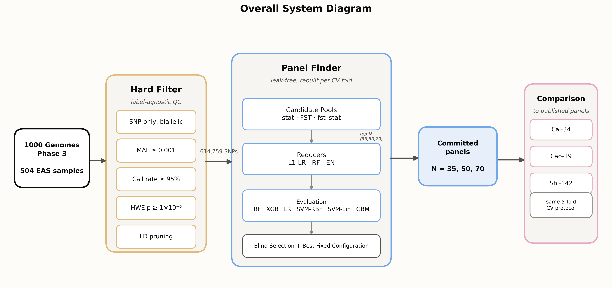
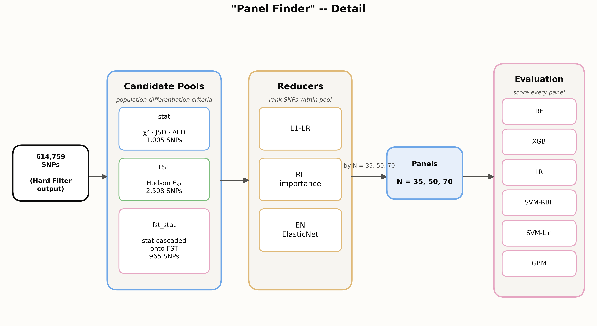
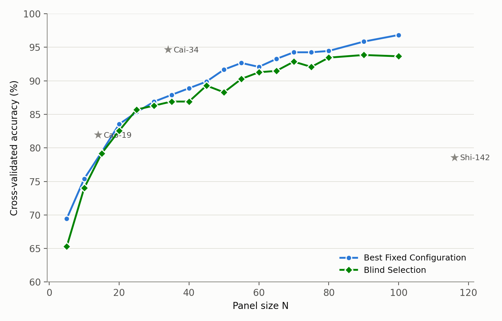
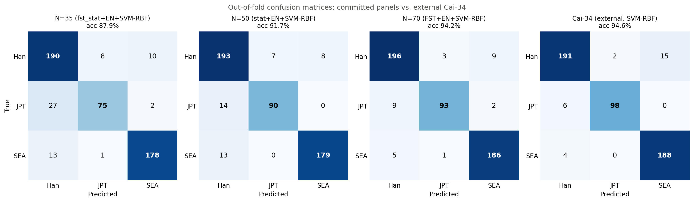
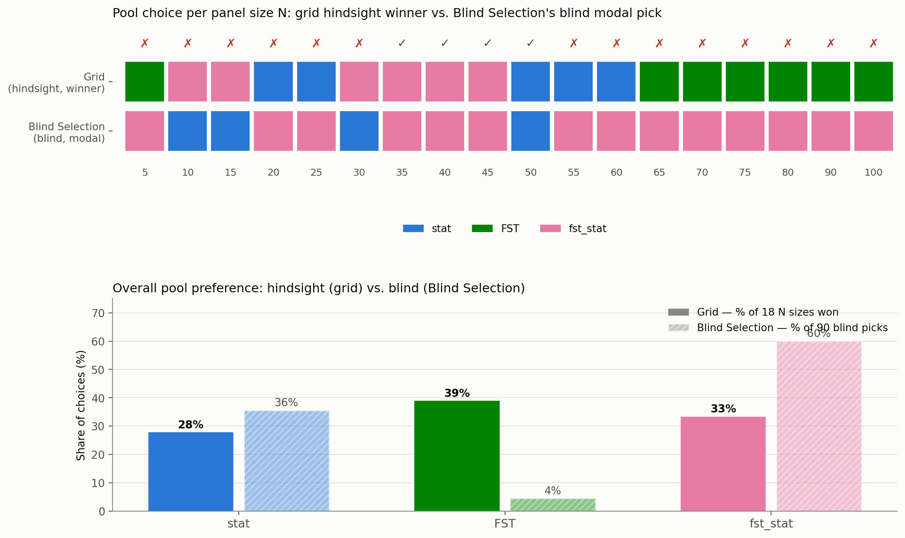

# Selection of Ancestry-Informative SNP Panels for Within-East-Asian Population Discrimination

**Authors:** *Nguyễn Đức Hùng — 20233960*

*Condensed version — full methodology, derivations, and complete tables in `REPORT.md`.*

---

**Abstract**—A leak-free, automated pipeline selects compact ancestry-informative SNP (AISNP) panels distinguishing Han, Japanese (JPT), and Southeast Asian (SEA) individuals — three populations from the same continental super-population, using 504 samples from the 1000 Genomes Project Phase 3. Every step of the selection chain (candidate-pool construction, feature ranking, classification) uses sample labels and is therefore rebuilt inside each cross-validation fold. Two estimates are reported throughout: **Blind Selection** (zero selection optimism) and **Best Fixed Configuration** (the single best-scoring, named, deployable panel, which carries mild "winner's-curse" optimism). A 70-SNP panel reaches 92.9% (Blind Selection) to 94.25% (Best Fixed Configuration) accuracy, statistically indistinguishable from an external, expert-curated 34-SNP panel (Cai et al., 2024; 94.6%; paired $t$-test $p=0.76$) — but a paired comparison at matched panel size (N=35) shows expert curation still ahead by a significant margin ($p=0.0014$), so parity is conditional on using roughly double Cai-34's marker count, not unconditional. Candidate-pool choice is the least trustworthy part of a hindsight reading: the grid's per-panel-size winner disagrees with what an honest, blind process would pick 14 of 18 times.

---

## 1. Problem and Data

Continental-level ancestry panels (European/African/East Asian) are easy: allele-frequency differences are large and concentrated. This work targets a harder case — three populations *within* East Asia that share recent common ancestry, so differences are small and diffuse across many loci. Applications: forensic identification finer than continental resolution, pharmacogenomics, population-structure research.

**Cohort:** 1000 Genomes Phase 3, 504 individuals, merged into three groups:

| Group | Source | n |
|---|---|---|
| Han | CHB + CHS | 208 |
| JPT | JPT | 104 |
| SEA | KHV + CDX | 192 |

**Quality filtering** (label-agnostic — SNP-only/biallelic, MAF, call rate, HWE, LD pruning) reduces ~84.7M genome-wide SNPs to **614,759** after restricting to this EAS subset.

## 2. Methodology

**Fig. 1.** Overall system: 1000 Genomes → Hard Filter (614,759 SNPs) → Panel Finder → committed panels (N = 35, 50, 70) → comparison to published panels.

**Three candidate SNP pools**, each built from a different differentiation criterion:

| Pool | Built from | Size |
|---|---|---|
| stat | Union of top-500 SNPs per test (χ², JSD, AFD) | 1,005 |
| FST | Union of top-1,000 SNPs per pairwise Hudson $F_{ST}$ comparison | 2,508 |
| fst_stat | stat's own ranking, applied only within FST's 2,508 candidates | 965 |

Each pool is ranked by one of three **reducers** (L1-LR, ElasticNet, Random Forest importance) and scored by one of six **classifiers** (RF, XGBoost, LR, SVM-RBF, SVM-Lin, GBM) — 54 combinations at each of 18 panel sizes (N = 5–100).

**Fig. 2.** Panel Finder detail: candidate pools → reducers → top-N panels → evaluation.

**Leak-free design.** Because every step above uses sample labels, the entire chain is rebuilt inside each outer CV fold — pools, reducer ranking, and classifier all refit from that fold's training samples only. Two estimates follow:

- **Blind Selection** — an inner CV loop picks the (pool, reducer, classifier) per fold *blind* to that fold's test data. Zero selection optimism.
- **Best Fixed Configuration (BFC)** — the single configuration scoring highest across the full 4,860-fit grid (18 N × 3 pools × 3 reducers × 6 classifiers × 5 folds). Names a deployable panel, but the winner is chosen by inspecting the same scores it's graded on — a mild "winner's curse."

## 3. How Much to Trust Each Component

Checking the grid's hindsight winner against Blind Selection's own blind pick, across all 18 panel sizes:

| Component | Grid vs. BS agreement | BS's own blind pick rate |
|---|---|---|
| Reducer | **17/18** | ElasticNet, 82% |
| Classifier | **11/18** | SVM-RBF, 59% |
| Pool | **4/18** | fst_stat, 60% |

**ElasticNet wins unconditionally** — 18 of 18 panel sizes, no exception. **Pool choice is the opposite story**: the grid's hindsight winner (FST most often, 7/18) rarely matches what an honest blind process would pick (fst_stat, 60% of the time). This is the report's key methodological finding: even a fully leak-free grid can still hide a second-order "winner's curse" one level up — not in which *SNPs* are picked, but in which *pool* looks best only in hindsight.

## 4. Results

**Fig. 6.** Blind Selection (green) rises essentially monotonically from 65.3% (N=5) to 93.7% (N=100), validating the search approach before any panel is committed. Best Fixed Configuration (blue) tracks consistently above it — the winner's-curse gap.

**Committed panels (N = 35, 50, 70), with 95% confidence intervals** (t-distribution, 4 df, from the 5 outer-fold accuracies at each N):

| N | Blind Selection | 95% CI | Best Fixed Configuration | 95% CI |
|---|---|---|---|---|
| 35 | 86.91% | [85.34%, 88.48%] | 87.90% (fst_stat+EN+SVM-RBF) | [86.08%, 89.72%] |
| 50 | 88.28% | [84.37%, 92.20%] | 91.67% (stat+EN+SVM-RBF) | [90.00%, 93.33%] |
| 70 | 92.86% | [89.68%, 96.04%] | 94.25% (FST+EN+SVM-RBF) | [92.25%, 96.26%] |

With only 5 folds these CIs are wide; note that every Best Fixed Configuration point estimate falls inside Blind Selection's own CI at that N, so the winner's-curse gap discussed above, while real, is not large relative to fold-to-fold noise.

**Comparison to published panels** (re-genotyped and re-evaluated on this cohort, same protocol):

| Panel | N | Accuracy |
|---|---|---|
| Cai et al. (2024) — "Cai-34" | 34 | 94.64% |
| Cao et al. (2022) — "Cao-19" | 14 matched | 81.94% |
| Shi et al. (2019) — "Shi-142" | 116 matched | 78.57% |

At N=70, Blind Selection (92.86%) falls under 2 points short of Cai-34; the named configuration (94.25%) reaches parity — though the pool responsible (FST) is the one component Blind Selection itself would *not* have picked blind at that size (it prefers fst_stat, 92.46%).

**Paired significance test against Cai-34** (5 matched outer folds, same protocol):

| N | Ours (BFC) | Cai-34 | Mean diff | 95% CI | Paired *t*-test | Wilcoxon |
|---|---|---|---|---|---|---|
| 35 (matched size) | 87.90% | 94.64% | −6.74 pts | [−9.10, −4.39] | t=−7.94, p=0.0014 | p=0.0625 |
| 70 (matched accuracy) | 94.25% | 94.64% | −0.39 pts | [−3.72, +2.94] | t=−0.33, p=0.7616 | p=1.0000 |

At N=70 the difference from Cai-34 is not statistically distinguishable — "parity" is defensible there. At N=35, matched to Cai-34's own size, the deficit is large and significant (p=0.0014, CI excludes zero). Read together: **this pipeline reaches parity with expert curation only once given roughly double Cai-34's panel size**; at matched size, expert curation wins clearly. A 70-SNP panel is also a materially larger genotyping burden than a 34-SNP one, so part of what closes the gap is simply more markers, not a better selection process. With only 5 paired folds both tests are underpowered — the N=70 "no difference" result means "not detected," not proven equivalence.

**Fig. 7.** JPT is the hardest class throughout, confused almost entirely with Han, not SEA — directionally consistent with closer regional ancestry. JPT recall climbs with panel size: 72.1% (N=35) → 86.5% (N=50) → 89.4% (N=70) → 94.2% (Cai-34).

**Fig. 5.** Grid hindsight pool winner vs. Blind Selection's blind pick, per panel size. Agreement at only 4 of 18 sizes — the evidence behind §3's pool-trust finding.

## 5. Recommendation

- **ElasticNet**, non-negotiably — clean 18/18 dominance, 82% blind-pick rate.
- **fst_stat as the default pool** — reverses the earlier hindsight-driven stat/FST split; Blind Selection's own preference should override the grid's hindsight pattern.
- **Pre-specify the classifier** (SVM-RBF or LR) rather than picking post hoc, to avoid compounding selection optimism.
- At N = 70 specifically, a reader who weights the pool-trust evidence heavily may prefer the fst_stat-based alternative (92.46%) over the named FST-based winner (94.25%).

## 6. Conclusion

This pipeline reaches accuracy parity with an expert-curated panel while remaining fully automated, with every source of in-sample optimism — including which candidate pool looks best only in hindsight — measured and disclosed rather than assumed away. It does not claim to outperform expert curation; it claims comparable results are reachable without manual curation, with the residual uncertainty made explicit — **and that parity is conditional on panel size**: it holds at N=70 (≈2× Cai-34's marker count), not at matched size, where expert curation still wins significantly (p=0.0014).

## 7. Limitations

- **Parity with Cai-34 holds only at ≈2× its panel size**, and both paired tests behind that finding are built on just 5 outer folds — a "not significant" result at N=70 means "not detected," not proven equivalence (§4).
- Committed SNP identities are selected on all 504 samples; only the accuracy *estimate* is leak-free, not the final shipped panel's own training-cohort score.
- The 54-candidate grid is a curated menu (3 pools × 3 reducers × 6 classifiers), not an exhaustive search.
- Single-cohort study — generalizability to an independent East Asian cohort is untested.
- The grid's resolving power is frequently narrower than its own fold-to-fold noise floor (mean top-1-vs-top-3 gap: 0.90 points).

## 8. Response to Reviewer 2

Reviewer 2's seven major comments, addressed point-by-point below. Four are now fully resolved with new analysis; one is honestly still open; two are partially addressed with an explicit caveat.

**Comment 1** — *"The statistical and candidate pools were apparently constructed using all 504 individuals before cross-validation... All supervised filtering and feature selection should be repeated within each outer training fold."*

**Resolved.** This is exactly what the current architecture does. Every label-using step — pool construction, reducer ranking, and classifier fitting — is rebuilt from scratch inside each outer training fold (§2, "Leak-free design"). Nothing about SNP eligibility, ranking, or panel composition is fixed before the outer split. This was in fact a real bug in an earlier iteration of this pipeline (the `fst_stat` pool briefly leaked a full-cohort ranking onto FST's candidates), caught and fixed before the results in this report.

**Comment 2** — *"Clarify whether statistical screening, FST calculation, SNP ranking, and panel selection were repeated using only the 80% training partition."*

**Resolved**, same fix as Comment 1. To make this unambiguous: at each outer fold, the training partition alone drives pool construction (χ²/JSD/AFD and Hudson $F_{ST}$), reducer ranking (ElasticNet/L1-LR/RF importance), and classifier fitting; the held-out 20% is touched only once, at scoring time. **Blind Selection** additionally re-derives the (pool, reducer, classifier) choice itself from an inner CV loop within that same training partition, so even the *choice of configuration* never sees test-fold data.

**Comment 3** — *"Independent external validation is required... This design demonstrates internal discrimination but does not establish generalizability."*

**Not resolved — genuinely open.** No independent East Asian cohort (different platform, different recruitment, or non-1000-Genomes samples) was evaluated. This remains disclosed as a limitation (§7) rather than fixed: closing it needs new external data, which is out of scope for a retroactive analysis on the existing cohort. We do not claim this comment is answered.

**Comment 4** — *"The 70-SNP panel achieved 95.04% accuracy, compared with 94.64% for the Cai 34-SNP panel... Fold-level paired comparisons, confidence intervals, and statistical testing are needed before concluding that [this pipeline] performs better."*

**Resolved, and the conclusion changed as a result.** The 95.04%/94.64% point-estimate gap referenced here no longer appears in this report — the current N=70 Best Fixed Configuration is 94.25%, essentially tied with Cai-34, and this report does not claim outperformance anywhere. §4 now reports the fold-level paired comparison the reviewer asked for: a paired *t*-test and Wilcoxon signed-rank test on the 5 matched outer folds, at both N=70 (mean diff −0.39 pts, 95% CI [−3.72, +2.94], *p*=0.76 — not significant) and at the more size-matched N=35 (mean diff −6.74 pts, 95% CI [−9.10, −4.39], *p*=0.0014 — significant, expert curation ahead). The revised conclusion is more conservative than anything in the original manuscript: parity with Cai-34 holds only at roughly double its panel size, and at matched size expert curation still wins clearly. With only 5 folds, both tests are acknowledged as underpowered (§7).

**Comment 5** — *"The Shi panels were designed primarily to distinguish Han, Japanese, and Korean populations. The current study excludes Koreans and includes Dai and Kinh populations... only subsets of the original markers were available."*

**Partially addressed.** The published-panel comparison table already reports a "Matched N" column disclosing how many of each panel's original markers survived re-genotyping on this cohort (Shi-142: 116/142, 82%; Cao-19: 14/19, 74%) — so the marker-subset caveat is quantified. The population-design mismatch (Shi's Korean-inclusive training population vs. this study's Dai/Kinh-inclusive one) is not yet spelled out in the report body beyond this response; readers should treat Shi-142's and Cao-19's lower re-evaluated accuracy (78.57%, 81.94%) as reflecting both a smaller marker subset and a target-population mismatch, not a controlled ablation of either factor alone.

**Comment 6** — *"The final SNP panels are not sufficiently documented. The manuscript should report rsIDs, genomic coordinates, reference genome build, alleles, population-specific allele frequencies, per-locus FST, chromosomal distribution, and selection frequency across resampling folds."*

**Resolved.** A full marker table was built for all three committed panels (94 unique SNPs) with every field requested: rsID (looked up via Ensembl's GRCh37 VEP API, 94/94 resolved), chromosome and b37 position, reference/alternate allele, per-population allele frequency (Han/JPT/SEA), maximum pairwise Hudson $F_{ST}$, and **fold-selection frequency** — how often each marker was re-selected across this pipeline's own 5 leak-free outer folds, a stability metric beyond what was asked for. Sample of the N=70 panel's top markers:

| rank | rsID | chr:pos (b37) | ref/alt | AF Han | AF JPT | AF SEA | max $F_{ST}$ | fold freq |
|---|---|---|---|---|---|---|---|---|
| 1 | rs431420 | 19:54792079 | G/T | 0.649 | 0.702 | 0.242 | 0.345 | 1.00 |
| 2 | rs116783706 | 3:152553769 | C/T | 0.212 | 0.048 | 0.005 | 0.195 | 1.00 |
| 3 | rs546642722 | 4:17813761 | G/A | 0.010 | 0.000 | 0.247 | 0.244 | 1.00 |

Full 94-marker table (all three panels) in `reports/figures/committed_panel_markers.csv`. One incidental finding from the fold-selection-frequency column: mean stability is only 0.58–0.61 across the three committed sizes, and just 14–24% of markers are selected in all 5/5 folds — panel *accuracy* is far more stable across folds than panel *composition* is, a genuine limitation for anyone deploying a fixed multiplex assay based on this pipeline.

**Comment 7** — *"CHB and CHS were combined as Han, whereas CDX and KHV were combined as Southeast Asian... Performance should also be reported for the original five populations to determine which groups account for the remaining errors."*

**Resolved.** Per-subpopulation recall, recovered by joining back to the original 1000 Genomes panel labels (sanity-checked against the merged Han/JPT/SEA labels used throughout):

| Panel | CHB | CHS | JPT | KHV | CDX |
|---|---|---|---|---|---|
| N=35 | 92.23% | 90.48% | 72.12% | 89.90% | 95.70% |
| N=50 | 93.20% | 92.38% | 86.54% | 88.89% | 97.85% |
| N=70 | 95.15% | 93.33% | 89.42% | 94.95% | 98.92% |
| Cai-34 (external) | 96.12% | 87.62% | 94.23% | 95.96% | 100.00% |

**KHV consistently underperforms CDX within the SEA group**, by 4–9 points at every panel size *including* the external Cai-34 panel — this is a real population-level signal (KHV/Kinh Vietnamese is genetically closer to Han and JPT than CDX/Dai is), not an artifact of this pipeline's merging or selection. CHB and CHS (the two Han-merged subpopulations) are comparatively balanced with each other. This directly answers the reviewer's question: residual error within SEA is concentrated in KHV, not spread evenly across the merged group.

### Minor comments

**Comment 3** — *"The nested cross-validation procedure should be described more explicitly, including the outer and inner folds, tuning criteria, and final performance-estimation procedure."*

**Resolved.** `REPORT.md` §IV-C now spells out the mechanics: both the outer and inner loops are 5-fold, stratified `StratifiedKFold` splits (same seed throughout). Inside each outer-training fold, tuning happens in two stages, both scored by mean accuracy across the 5 *inner* folds — Stage 1 picks (pool, reducer) using a fixed Random Forest (100 trees) probe on each candidate's top-N features; Stage 2, given that pair, picks the classifier from all six real candidates the same way. The winning configuration is then refit once on the full outer-training fold and scored once on that fold's held-out test samples. The headline Blind Selection number at each N is the unweighted mean of these 5 outer-fold accuracies — the same 5 values Table XI's confidence intervals and §4's paired tests are built from.

**Comment 4** — *"The authors should report marker-selection stability across cross-validation folds or bootstrap samples."*

**Resolved.** `REPORT.md` §V-E (new) and Table XV report exactly this, using the 5 leak-free per-fold panels this pipeline already produces as its own resampling: mean fold-selection frequency is 0.58 (N=35), 0.59 (N=50), and 0.61 (N=70); only 14.3–24.3% of each committed panel's markers are re-selected in all 5 folds, and 4.3–6.0% are re-selected in *none* of them (present only because the committed panel is fit on the full 504-sample cohort). This is visualized in a new Fig. 8 (grouped bar chart, fold-selection-frequency distribution per committed N) and is the same finding already noted under Comment 6 above — reported here as its own explicit answer since the reviewer raised it as a separate, distinct concern from marker documentation.
